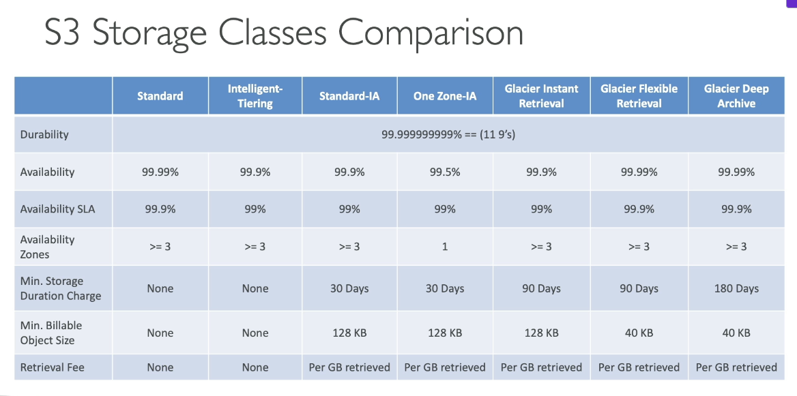
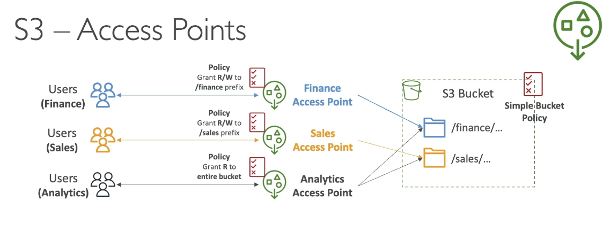

Amazon S3
=========

General
-------

.. admonition:: What is Amazon S3?

   - **Definition**:

     - Amazon Simple Storage Service (S3) is AWS's scalable, durable object storage service.
     - Used as a foundational building block for many AWS services and architectures.

   - **Key Concepts**:

     - Infinitely scalable storage with 99.999999999% (11 9's) durability.
     - Object-based storage: Stores data as *objects* within *buckets*.
     - Globally unique bucket names.
     - Region-specific bucket deployment.

.. admonition:: ✅ Use Cases for Amazon S3

   - Backup and storage (files, disks, etc.)
   - Disaster recovery (cross-region replication)
   - Archival (e.g. S3 Glacier, cheaper long-term storage)
   - Hybrid cloud storage (on-premise + cloud)
   - Media hosting (video, images)
   - Hosting static websites
   - Delivering software updates
   - Data lakes and big data analytics

   **Real-World Examples**:

   - Nasdaq uses S3 Glacier to archive 7 years of data.
   - Sysco runs analytics to gain business insights via Amazon S3.

.. admonition:: Buckets & Objects

   - **Bucket**:

     - Top-level container in S3.
     - Created within a specific region.
     - Must have a globally unique name.

   - **Naming Requirements**:

     - No uppercase letters or underscores.
     - Length: 3 to 63 characters.
     - Must not resemble an IP address.
     - Begin with a lowercase letter or number.
     - Not start with prefix "xn- -", or end with suffix "-s3alia"

   - **Objects**:

     - Stored within buckets.
     - Each object has a *key* (full path name).
     - Keys can simulate folders using "/" separators.
     - Maximum object size: **5TB**.
     - Objects > 5GB require **multi-part upload**.

.. admonition:: Object Structure

   - **Key**:

     - Unique identifier for each object in the bucket.
     - Example: s3://my-bucket/my-folder/another-folder/myfile.txt
               kye is 'my-folder/another-folder/myfile.txt'. Prefix: my_folder/another_folder/, Object name: my_file.txt

   - **Value**:

     - Actual content (binary or text).
     - 5TB max.
     - Multi-part Upload: > 5TB max.

   - **Metadata**:

     - System-defined and user-defined key-value pairs.
     - Used to describe properties of the object.

   - **Tags**:

     - Up to 10 Unicode key-value pairs.
     - Useful for lifecycle rules, access policies, and tracking.

   - **Version ID**:

     - Assigned when versioning is enabled on the bucket.

.. admonition:: ✅ Storage & Upload Notes

   - Multi-part Upload:

     - Required for uploading large files efficiently.
     - Especially for files > 5GB.

   - Versioning:

     - Enables multiple versions of the same object.
     - Useful for recovery and rollback.

.. admonition:: 🔍 Summary

   - Amazon S3 is foundational to many AWS architectures.
   - Offers scalable, durable, and flexible storage.
   - Suitable for backup, archival, analytics, web hosting, and more.
   - Buckets and objects are core concepts to understand.
   - Follow naming rules and regional deployment considerations.

.. admonition:: 🔗 To Learn More

   - Hands-on with the AWS Console to create buckets, upload objects, enable versioning.
   - Explore S3 lifecycle rules, S3 Glacier, and cross-region replication.
   - Try integrating S3 with other services (e.g., Lambda, Athena, Redshift).

.. admonition::  Security

   - User-Based:
      IAM Policies - which API calls should be allowed for a specific user from IAM.
   - Resource-Based:
      Bucket Policies - bucket wide rules from the S3 console - allows across account.
      Object Access Control List (ACL) - finer grain (can be disabled)
      Bucket Access Control List (ACL) - less common (can be disabled)

.. admonition::  S3 Bucket Policies

   - JSON based
   - Resources: buckets and objects
   - Effect: Allow/Deny
   - Actions: Set of API to Allow or Deny
   - Principal: The account or user to apply the policy to
   - If your bucket should never be public, leave the Block Public Access on.

.. admonition::  S3 Version

   - Know the difference between on and off "Show versions".
   - Off: To delete an object with a specific version, enable 'Show versions' to view versioned keys. You can reverse a deletion by removing the delete marker (version key).
   - On: Delete permenently.

.. admonition:: Amazon S3 Replication

   - **Two types:**

     - **CRR (Cross-Region Replication)**: Replicates objects to a bucket in a *different* region
     - **SRR (Same-Region Replication)**: Replicates objects to a bucket in the *same* region

   - **Requirements:**

     - Versioning must be enabled on both source and destination buckets
     - Proper IAM permissions are required for S3 to perform replication
     - Buckets can be in different AWS accounts
     - Replication is asynchronous (runs in the background)

   - **CRR Use Cases:**

      - Compliance and disaster recovery
      - Lower latency data access in another region
      - Cross-account replication

   - **SRR Use Cases:**

     - Log aggregation across multiple buckets
     - Live replication between production and test environments

   - **Only new objects** are replicated after enabling replication.
   - To replicate **existing objects** and previously **failed replications**, use **S3 Batch Replication**.
   - **Delete markers** can optionally be replicated from source to destination.

     - **Permanent deletions with version ID** are *not* replicated to avoid propagating malicious deletes.

   - **Replication chaining is not supported**:

     - If Bucket A replicates to Bucket B, and Bucket B replicates to Bucket C, objects from A will *not* reach C.

S3 Storage
----------

.. admonition:: Storage Classes

   Can move manually or S3 lifecycle configurations

   - Amazon S3 Standard - General Purpose
   - Amazon S3 Intelligent-Tiering*
   - S3 Express One Zone**
   - Amazon S3 Standard - Infrequent Access (IA)
   - Amazon S3 One Zone - IA
   - Amazon S3 Glacier Instant Retrieval
   - Amazon S3 Glacier Flexible Retrieval
   - Amazon S3 Glacier Deep Archive
   - Amazon S3 Intelligent Tiering

.. admonition:: Use Cases

   **S3 Standard (General Purpose): General purpose storage for frequently accessed data**
      - Big data analytics - For frequently accessed datasets requiring high throughput
      - Mobile and gaming applications - Low latency access for app data and user content
      - Content distribution - Serving websites, media files, and frequently downloaded content
      - Primary storage - Default choice for active workloads and frequently accessed data

   **S3 Intelligent-Tiering*: Automatic cost savings for data with unknown or changing access patterns**
      - New, check the link below.

   **S3 Express One Zone: High performance storage for your most frequently accessed data**
      - New, check the link below.

   **S3 Standard-Infrequent Access (Standard-IA): Infrequently accessed data that needs millisecond access**

      - Disaster recovery - Backup data that needs rapid access during emergencies
      - Long-term backups - Data accessed less frequently but requiring quick retrieval when needed
      - File synchronization - Secondary copies of important files
      - Data archiving - Medium-term storage where occasional access is required

   **S3 One Zone-Infrequent Access (One Zone-IA): Re-creatable infrequently accessed data**

      - Secondary backup copies - Non-critical backups where you can tolerate AZ loss
      - On-premises data replicas - Storing copies of data that exists elsewhere
      - Recreatable data - Data that can be regenerated if lost (processed datasets, thumbnails)
      - Cost-sensitive archiving - When you need lower costs and can accept higher risk

   **Glacier Instant Retrieval: Long-lived data that is accessed a few times per year with instant retrievals**

      - Medical imaging archives - Patient records accessed quarterly for compliance
      - Financial records - Regulatory data requiring instant access but infrequent use
      - Legal documents - Case files that may need immediate retrieval
      - Quarterly reporting data - Business intelligence data accessed once per quarter

   **Glacier Flexible Retrieval: Backup and archive data that is rarely accessed and low cost**

      - Media archives - Video/audio content for production companies
      - Scientific data - Research datasets for periodic analysis
      - Compliance archives - Regulatory data with flexible retrieval requirements
      - Backup restoration - System backups where you can wait hours for recovery

   **Glacier Deep Archive: Archive data that is very rarely accessed and very low cost**

      - Long-term compliance - 7-10 year regulatory retention requirements
      - Digital preservation - Libraries, museums, historical records
      - Tape replacement - Migrating from physical tape storage systems
      - Rarely accessed archives - Data kept for legal/compliance but almost never accessed

   **S3 Intelligent-Tiering**

      - Unknown access patterns - New applications where usage isn't predictable
      - Changing workloads - Data that transitions between frequent and infrequent access
      - Cost optimization - Automatic savings without operational overhead
      - Mixed datasets - Large datasets with varying access frequencies
      - Set-and-forget archiving - When you want automatic optimization without manual management

   Key Decision Factors:
      - Choose based on:
         - Access frequency - How often you need the data
         - Retrieval time tolerance - How quickly you need access (milliseconds to days)
         - Cost sensitivity - Balance between storage cost and retrieval cost
         - Durability requirements - Whether you can tolerate AZ-level failures
         - Operational overhead - Whether you want manual control or automatic optimization

   Common Migration Patterns:
      - Active data → S3 Standard
      - Aging data → Standard-IA (after 30 days)
      - Archive data → Glacier classes (after 90+ days)
      - Long-term retention → Deep Archive (after 180+ days)

   You can find more information here:`Amazon S3 Storage Classes <https://aws.amazon.com/s3/storage-classes/#topic-6>`_

.. admonition:: Lifecycle Rules

   - **Transsition Actions - configure objects to transition to another storeage class.**
      - Move objs to Standard IA class 60 days after creation.
      - Move to Glacier for archiving after 6 months.

   - **Expireation actions - configure objects to expire / delete after some time.**
      - Access log files can be set to delete after a 365 days.
      - Can be used to delete old versions of files (if versioning is enabled).
      - Can be used to delete incomplete Multi-Part uploads

   - **Rules can be created for a certain prefix (s3://mybucket/mp3/*)**
   - **Rules can be created for certain objecs Tags (Department:Finance)**

.. admonition:: Scenario

   - Your application on EC2 creates images thumbnails after profile photos are uploaded to Amazon S3. These thumbnails can be easily recreated, and only need to be kept for 60 days. The source images should be able to be immediately retrieved for these 60 days, and afterwards, the user can wait up to 6 hours.
      - S3 source images can be on Standard, with a lifecycle configuration to transition them to Glacier after 60 days.
      - S3 thumbnails can be on One-Zone IA, with a lifecycle configuration to expire them (delete them) after 60 days.

   - A rule in your company states that you should be able to recover your delete S3 objecs immediately for 30 days, although this may happen rarely. After this time, and for up to 365 days, delete objects should be recoverable within 48 hrs.
      - Enable S3 versioning in order to have object versions, so that "deleted objects" are in fact hidden by a "delete marker" and can be recovered.
      - Transition the "noncurrent versions" of the objects to Standard IA
      - Transition afterwards the "noncurrent versions" to Glacier Deep Archive

.. admonition:: Storage Class Analysis

   - when to transition objects to the right storages class
   - Recommendations for Standard and Standard IA (NOT work for One-Zone IA or Glacier)
   - Report is updated daily
   - 24 - 48 hours to start seeing data analysis

S3 Event Notifications
----------------------
You can find more information here:`Amazon S3Event Notifications Hands On <https://www.udemy.com/course/aws-certified-machine-learning-engineer-associate-mla-c01/learn/lecture/45356569#content>`_

S3 event notification is a feature of Amazon S3 that automatically sends notifications when specific events occur in the S3 buckets. This allows you to trigger automated workflows and processes in reponse to changes in the S3 data.
   - Object creation (PUT, POST, COPY, or multipart upload completion)
   - Object deletion
   - Object restoration from Glacier
   - Relication events

.. admonition:: Supported Destinations

   - Amazon SQS queues
   - Amazon SNS topics
   - AWS Lambda functions

In order to make S3 Event Notifications work, IAM Permissions will be needed.

.. admonition:: IAM Permissions

   - SQS Resource (Access) Policy
   - SNS Resource (Access) Policy
   - Lambda Resource Policy

S3 Event Notifications with Amazon EventBridge.

   - EventBridge is AWS's managed event routing service that provides real-time access to changes in data from AWS services, custom applications, and SaaS applications without writing code. It acts as a central hub for routing events between different systems and services.
   - All events go to EventBridge.
   - Over 18 AWS services as destinations
   - Adanced filtering options with JSON rules (metadata, object size, name ...)
   - Multiple Destinations - ex Step Functions, Kinesis Streams/ Firehose ...
   - EventBridge Capabilities - Archive, Replay Events, Reliable delivery

S3 Performance
--------------

.. admonition:: Baseline Performance

   - Automatically scales
   - 3500 PUT/COPY/POST/DELETE,5500 GET/HEAD, per sec per prefix
   - NO Limits to the number of prefixs in a bucket
      - bucket/foldeer1/sub1/file => prefix: /folder1/sub1/

.. admonition:: Performance upload transfer

   - Multi-Part Upload
      - recoomended > 100mb
      - MUST > 5GB
      - Parallelize uploads

   - Transfer Acceleration
      - Increase transfer speed by transferring file to an AWS edge location which will forward the data to the S3 bucket in the target region.
      - Compatible with multi-part upload.

.. admonition:: Performance - S3 Byte-Range Fetches

   - Parallelize GET by requesting specific byte ranges.
   - Better resilience in case of faailures
   - Can be used to speed up downloads.
   - Can be use to retrieve only partial data (etc, head of a file)

Amazon S3 Object Encryption
---------------------------

You can find more information here:`Amazon S3 Encryption Hands On <https://www.udemy.com/course/aws-certified-machine-learning-engineer-associate-mla-c01/learn/lecture/45356611#content>`_

.. admonition:: Encrypt objects in S3 buckets using one of 4 methods

   - Server-Side Encription (SSE):
      - SSE-S3, Enabled by default
      - SSE-KMS
      - SSE-C customer-keys
   - Client-Side Encryption

**When and Where to use:**

.. admonition:: Amazon S3 Encryption

   - Encryption using keys handled, managed and owned by AWS
   - Object is encrypted server-side
   - Encryption type is AES-256
   - Must set header "x-amz-server-dide-encryption":"AES256"
   - Enabled by default for new buckets and new objects

.. admonition:: SSE-KMS

   - Encryption using keys handled and managed by AWS KMS
   - user control + audit key usage using CloudTrail
   - Object is encrypted server side
   - Must set header "x-amz-server-side-encryption":"aws:kms"
   - Need API call to generate KMS key for de-en crypt, so there is a traffic limitation
   - Count towards the KMS quota per second

.. admonition:: SSE-C

   - Server-side Encryption using keys fully managed by the customer outside of AWS
   - Not store the Key on S3
   - HTTPS must be used (of course, action to the key)
   - Key must provided in HTTP headers , for every HTTP request made.

.. admonition:: Cline-side Encryption

   - Use client libraries (Amazon S3 Client-Side Encryption Library)
   - Client must en-de crypt data themself before / after
   - Users fully manage the keys and encryption cycle.

.. admonition:: Transit (SSL/TLS)

   - 2 endpoints HTTP/HTTPS
   - HTTPS is recommended
   - HTTPS is mandatory for SSE-C
   - Most clients use HTTPS as default
   - Force Encryption in Transit, Aws:SecureTransport
      - This can be done in the Bucket Policy: Condition

S3 Access Points
----------------

- Access Points should enforce role-based access control (RBAC), so that users’ network access is restricted according to their role. Just like bucket policy.

- Each Access Point has its own DNS name (Internet Origin or VPC origin)

.. admonition:: VPC Origin

   - Define the access point to be accessible only from within the VPC
   - Must create a VPC Endpoint to access the Gateway or Interface Endpoint
   - VPC endpoint Policy MUST allow access to **BOTH bucket and access point**, end

.. admonition:: Object Lambda

   .. image:: images/lambda.png

   - Use AWS Lambda Functions to change the object before it is retrieved by the caller application

   - Only one S3 bucket is needed, on top of which we create **S3 Access Point and S3 Object Lambda Access Points**

   - Redacting personally identifiable information for analytics or non-production environments.
      - Converting across data formats, such as converting XML to JSON.
      - Resizing and watermarking images on the fly using caller-specific details, such as the user who requested the project.

Amazon EBS
----------

You can find more information here:`EBS Hands On <https://www.udemy.com/course/aws-certified-machine-learning-engineer-associate-mla-c01/learn/lecture/45356655#content>`_

**What is an EBSVolume?**
   - An EBS(Elastic Block Store) Volume is a network drive that you can attach to your instances while they run.
   - It allows your instances to persist data, even after their termination.
   - They can only be mounted to one instance at a time (at the CCP level).
   - They are bound to a specific availablility zone
   - Think of them as a "Network USB stick"
      - Uses the network to communicate the instance (latency)
      - Detached/attached to another EC2 instance quickly
      - Locked to ana Availability Zone (AZ)
      - To move a volume across, need to snapshot it.
      - Have a provisioned capacity (size in GBs, and IOPS)
   - Delete on Termination attribute
      - By default, the root EBS volume is deleted (attribute enabled)
      - By default, any other attached EBS volume is not deleted (attribute disabled)
   - This can be controlled by the AWS console / AWS CLI

**Amazon EBS Elastic Volumes**
   - Don't have to detach a volume or restart instance to chanage it.
   - ONLY can increase, not decrease.
   - Change volume type
      - Gp2 -> Gp3
      - Specify desired IOPS or throughput performance
   - Adjust performance
      - Increase / decrease

Amazon EFS - Elastic File System
-----------------------------------
   - Managed NFS (network file system) that can be mounted on many EC2
   - EFS works with EC2 instances in multi-AZ
   - Highly available, scalable, expensive (3 times cost to gp2), pay per use.
   - Use cases:
      - Content management
      - Web serving
      - Data sharing
      - Wordpress
   - Uses NFSv4.1 protocol
   - Uses security group to control access to EFS
   - Compatible with Linux based AMI (NOT Windows)
   - Encryption at rest using KMS
   - POSIX file system that has a standard file API
   - FIle system scales automatically, pay-per-use, no capacity planning.

   .. image:: images/efs.png

**Amazon EFS - Performance & Storage Classes**
   - EFS Scale
      - 1000s of concurrent NFS clients, 10GB+ /s throughput
      - Grow to Petabyte-scale network file system, automatically
   - Performance Mode (Set at EFS creation time)
      - General Purpose(default) - webserver (latency-sensitive)
      - Max I/O - high latency, throughput, highly parallel (big data, media processing)
   - Troughput Mode [3 modes]
      - Busting - 1TB = 50MiB/s + burst of up to 100MiB/s
      - Provisioned - set your throughput regardless of storage size, ex: 1GiB/s for 1TB storage
      - Elastic - Automatically scales throughput up or down based on your workloads.
         - Up to 3GiB/s for reads and 1 GiB/s for writes
         - Used for unpredictable workloads.

   - EFS Storage Classes
      - Storage Tiers (lifecycle management feature move file after N days)
         - Sandard: for frequently accessed files
         - Infrequent access (EFS-IA): cost to retrieve files, lower price to store
         - Archive: rarely accessed data (few times each year) 50% cheaper
         - Implement lifecycle policies to move files between storage tiers

      - Availablility and durability
         - Standard: multi-AZ, great for production
         - One zone: One AZ, great for dev, backup enabled by default, compatible with IA (EFS One Zone-IA)

      - Over 90% in cost savings.

   You can find more information here:`EFS Hands On <https://www.udemy.com/course/aws-certified-machine-learning-engineer-associate-mla-c01/learn/lecture/45356675#content>`_

EBS VS EFS
----------

.. admonition:: EBS

   - EBS volumes:
      - One instance (except multi-attach io1/io2)
      - Are locked at the availablility Zone (AZ) level
      - gp2: IO increase if the disk size increses
      - gp3 & io1: can increase IO independently
   - To migrate an EBS volume across AZ
      - Take a snapshot
      - Restore the snapshot to another AZ (This is how to move instance between AZ)
      - EBS backups use IO and you shouldn't run them while your application is handling a lot of traffic
         .. image:: images/moveEBS.png
   - Root EBS Volumes of instances get terminated by default if the EC2 instance gets terminated.(option to disable)

.. admonition:: EFS

   - Mounting 100s of instances across AZ
   - EFS share website files (WordPress)
   - Only for Linux
   - EFS has a higher price point than EBS
   - Can leverage Storage Tiers for cost savings

   .. image:: images/accEFS.png

**Know difference: EFS, EBS, Insance Store**

Amazon FSx
----------

Overview:
   - Launch 3rd party high-performance file systems on AWS
   - Fully managed service

.. admonition:: Windows (File Server)

   - Fully managed Windows files system share drive
   - Supports SMB protocol & Windows NTFS
   - Microsoft Active Directory integration, ACLs, user quotas
   - Can be mounted on Linux EC2 instances
   - Supports Microsoft's Distributed File System (DFS) Namespaces (Group files across multiple FS)
   - Scale up to 10s of GB/s, millions of IOPS, 100s PB of data
   - Storage Options:
      - SSD: latency sensitive workloads (databases, media processing, data analytics, ...)
      - HDD: broad spectrum of workloads (home directory, CMS, ...)
   - Can be accessed from your on-premises infrastructure (VPN or Direct Connect)
   - Configured to be Multi-AZ (high availability)
   - Data is back-up daily to S3

.. admonition:: Lustre (Lunix, cluster)

   - Parallel distributed file system, for large-scale computing
   - Mchine Learning, High Performance Computing (HPC)
   - Video Processing, Financial Modeling, Electronic Design Automation
   - Scales up to 100s GB/s, millions of IOPS, susb-ms latencies
   - Storage Options:
      - SSD: low latency, IOPS intensive workloads, small, random file operations.
      - HDD: throughput-intensive workloads, large, sequential file operations.
   - Seamless integration with S3
      - can read S3 as a file ssystem (through FSx)
      - can write the output of the computations back to S3 (through FSx)
   - Can be used from on-premises servers (VPN or Direct Connect)

.. admonition:: FSx Deployment Options

   - Scratch file system:
      - Temporary
      - Not replicated
      - High burst
      - Usage: short-term processing, optimize costs
      .. image:: images/FSx.png

   - Persistent file system:
      - Long-term storage
      - Replicated within same AZ
      - Replace failed files within minutes
      - Useage: Long-term processing, sensitive data
      .. image:: images/FSx-2.png