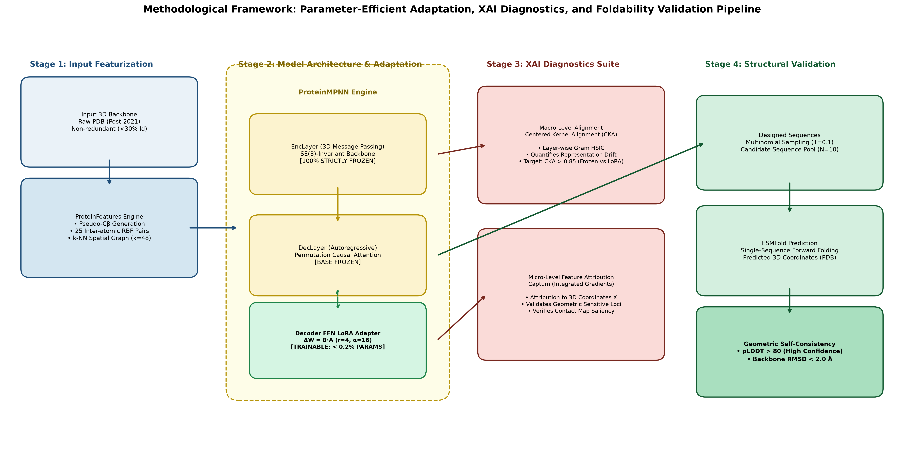
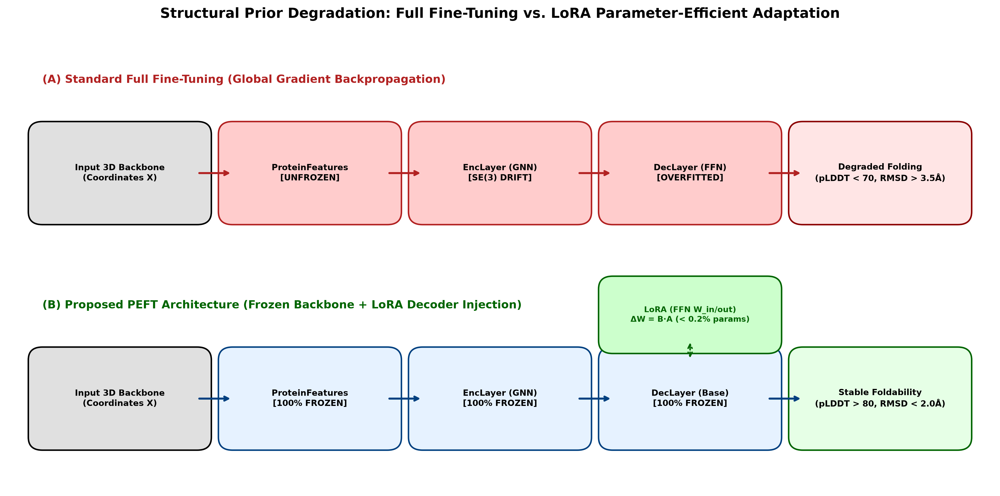

================================================================================================
Research Proposal: Parameter-Efficient Adaptation and XAI Diagnostics for Inverse Protein Design
================================================================================================

.. meta::
   :description: Research proposal draft on LoRA adaptation, catastrophic forgetting mitigation, and XAI diagnostics for ProteinMPNN.
   :keywords: ProteinMPNN, LoRA, PEFT, Catastrophic Forgetting, CKA, Captum, ESMFold

.. contents:: Table of Contents
   :depth: 2
   :local:

Executive Summary
=================

本研究计划旨在解决基于深度学习的逆向蛋白质设计模型在特定下游生物物理性质适配时的结构退化问题。作为反向折叠领域的代表性工作，**ProteinMPNN (Dauparas et al., Science, 2022)** 具备强大的零样本（Zero-shot）3D 几何表征与骨架折叠能力[cite: 2, 3]。然而，当面向极端热稳定性或宿主表达偏好进行任务微调时，传统的全参数微调极易破坏预训练模型对空间拓扑的记忆，引发灾难性遗忘。

本项目提出采用**低秩自适应（Low-Rank Adaptation, LoRA）**对 ProteinMPNN 实施参数高效微调（PEFT），在完全冻结 3D 结构编码器的前提下，仅微调解码器前馈层极小比例（< 0.2%）的参数。同时，引入**中心核对齐（CKA）**与**积分梯度（Captum Integrated Gradients）**构建双重可解释性（XAI）特征诊断流水线，并结合 **ESMFold** 回测系统，建立“参数轻量注入 - 隐层表征对齐 - 特征归因诊断 - 结构自洽验证”的完整闭环评估体系。

   Figure 1: End-to-End Architectural Pipeline for LoRA Adaptation, XAI Diagnostics, and ESMFold Validation.

Research Objectives & Core Deliverables
=======================================

本项目计划达成以下四个维度的具体目标：

1. **Parameter-Efficient Adaptation Engine**：构建非侵入式 LoRA 注入模块，实现仅更新 < 0.2% 参数即可使序列具备目标下游性质。
2. **Data-Leakage Free Pipeline**：建立严格的时间截断与同源去冗余数据集划分规范，保证测试样本对预训练模型完全未见。
3. **Multi-Scale XAI Diagnostic Protocol**：利用 CKA 与 Captum 形成宏观矩阵相似度与微观原子归因的双尺度抗遗忘验证探针。
4. **Self-Consistent Foldability Verification**：依托 ESMFold 计算 pLDDT 与 RMSD 指标，实现在硅（In Silico）结构折叠验证闭环。

Data Curation & Homology Separation Protocol
=============================================

为规避数据泄露（Data Leakage）并确保评价体系的绝对客观，下游微调与测试数据集需执行严格的生物信息学过滤：

* **Temporal Split**：仅采用 2021 年之后在 PDB 数据库释放的全新蛋白质三维结构（Post-2021 PDB releases），与预训练切片完全隔离。
* **Sequence Identity De-redundancy**：使用 MMseqs2 进行全局序列聚类，剔除与 ProteinMPNN 原生训练集相似度大于 30% 的所有同源链（Homology threshold < 30%）。
* **Data Serialization**：将三维原子坐标统一处理为包含 ``N, CA, C, O`` 四原子点云的定长 ``.jsonl`` 结构字典。

.. code-block:: text

   # Data Protocol Specification
   Raw PDB Files (Post-2021) ──► MMseqs2 (Cluster < 30% Identity) ──► JSONL Data Serialization

Experimental Methodology & Architecture Design
==============================================

1. Model Configuration & Controlled Baselines
---------------------------------------------

实验设计包含三组严格受控的对比模型：

.. list-table:: Experimental Comparison Matrix
   :widths: 25 20 25 30
   :header-rows: 1

   * - Model Designation
     - Trainable Parameters
     - Adaptation Strategy
     - Scientific Role
   * - **Zero-shot Baseline**
     - 0 (0.00%)
     - Completely Frozen
     - Performance Benchmark[cite: 2]
   * - **Full Fine-Tuning**
     - ~16.2M (100.0%)
     - Global Backpropagation
     - Catastrophic Forgetting Negative Control
   * - **LoRA Adaptation (Ours)**
     - ~15K (< 0.20%)
     - Decoder FFN Injection
     - Proposed Mitigation Strategy

2. LoRA Injection Implementation
--------------------------------

在 ``protein_mpnn_utils.py`` 的解码器前馈层 ``PositionWiseFeedForward`` 中注入低秩增量矩阵：

.. code-block:: python

   import math
   import torch
   import torch.nn as nn

   class LoRALinear(nn.Module):
       """
       LoRA Adapter for Feed-Forward Networks in ProteinMPNN Decoder.
       Decomposes weight updates: delta_W = (B * A) * (alpha / r)
       """
       def __init__(self, original_linear: nn.Linear, r: int = 4, lora_alpha: float = 16.0, lora_dropout: float = 0.1):
           super().__init__()
           self.original_linear = original_linear

           # Freeze base pre-trained weights
           self.original_linear.weight.requires_grad = False
           if self.original_linear.bias is not None:
               self.original_linear.bias.requires_grad = False

           self.r = r
           self.scaling = lora_alpha / r

           # Low-rank learnable parameter matrices
           self.lora_A = nn.Parameter(torch.zeros(r, original_linear.in_features))
           self.lora_B = nn.Parameter(torch.zeros(original_linear.out_features, r))
           self.dropout = nn.Dropout(p=lora_dropout) if lora_dropout > 0. else nn.Identity()

           # Weight initialization: Kaiming uniform for A, zero initialization for B
           nn.init.kaiming_uniform_(self.lora_A, a=math.sqrt(5))
           nn.init.zeros_(self.lora_B)

       def forward(self, x: torch.Tensor) -> torch.Tensor:
           base_output = self.original_linear(x)
           lora_output = (self.dropout(x) @ self.lora_A.T @ self.lora_B.T) * self.scaling
           return base_output + lora_output

Multi-Scale XAI Diagnostic Framework
====================================

本项目从宏观表示矩阵相似度与微观残基特征敏感度两个层级，对微调后的模型进行“病理切片式”诊断：

1. Macro-Level Representation Analysis (Layer-Wise CKA)
-------------------------------------------------------

计算冻结基准模型与微调模型各层隐藏特征激活向量 :math:`X` 与 :math:`Y` 之间的中心核对齐得分（CKA）：

.. math::

   \text{CKA}(K, L) = \frac{\text{HSIC}(K, L)}{\sqrt{\text{HSIC}(K, K) \cdot \text{HSIC}(L, L)}}

* **评价指标**：CKA 取值范围为 :math:`[0, 1]`。若 LoRA 模型的各层 CKA 得分持续稳定在 :math:`> 0.85`，则定量证明内部三维拓扑特征表征未发生结构性溃退。

2. Micro-Level Feature Attribution (Captum Integrated Gradients)
----------------------------------------------------------------

采用 PyTorch 官方可解释性框架 **Captum**，针对输入的三维骨架原子坐标张量 :math:`X \in \mathbb{R}^{B \times L \times 4 \times 3}` 计算逐残基积分梯度：

.. math::

   \text{Attr}_i(x) = (x_i - x_i') \times \int_{0}^{1} \frac{\partial F(x' + \alpha (x - x'))}{\partial x_i} \, d\alpha

* **评价指标**：分析高贡献度残基与目标位点之间的三维空间欧氏距离分布，验证微调模型是否保留了对空间物理微环境的敏感性。

Structural Foldability Evaluation (ESMFold Pipeline)
====================================================

利用正向折叠工具 **ESMFold** 对模型设计的氨基酸序列进行自洽性结构回测：

.. code-block:: text

   Input 3D Backbone ──► ProteinMPNN Sampling ──► Designed Sequences ──► ESMFold Structure Prediction
                                                                                   │
                                                                                   ▼
   Evaluation Metrics: pLDDT (Confidence) & Backbone RMSD (Alignment) ◄────────────┘

* **Predicted Local Distance Difference Test (pLDDT)**：评估序列折叠的局部二级结构规整度（目标阈值：``pLDDT > 80``）。
* **Root-Mean-Square Deviation (RMSD)**：将预测结构原子与真实天然骨架进行三维刚体叠合（Superimposition），评估折叠准确度（目标阈值：``RMSD < 2.0 Å``）。

Work Breakdown Structure & Research Roadmap
===========================================

.. list-table:: Project Execution Milestones
   :widths: 15 35 30 20
   :header-rows: 1

   * - Phase
     - Milestone Description
     - Core Toolchain
     - Status
   * - **Phase 1**
     - Source Code Audit & LoRA Prototype Injection
     - PyTorch, ``protein_mpnn_utils.py``
     - Completed
   * - **Phase 2**
     - Benchmark Dataset Curation (< 30% Identity)
     - MMseqs2, PDB REST API
     - In Progress
   * - **Phase 3**
     - Adaptation Training & Ablation Verification
     - CUDA, LoRA, CosineAnnealingLR
     - Pending
   * - **Phase 4**
     - Dual-Scale XAI Diagnostic Profiling
     - Captum (IG), Centered Kernel Alignment (CKA)
     - Pending
   * - **Phase 5**
     - ESMFold Back-folding & Metric Analytics
     - ESMFold, PyMOL, BioPython
     - Pending

理论依据与文献综述：全参数微调缺陷与参数高效微调（PEFT/LoRA）的必要性
===========================================================

研究背景与核心矛盾
---------------

在利用深度生成模型进行逆向蛋白质设计（Inverse Protein Design）时，将通用预训练模型（如 ProteinMPNN）适配到特定的下游生物物理任务（例如极端热稳定性优化、宿主表达偏好改造）是极其关键的研究方向[cite: 2]。然而，直接对模型实施传统的**全参数微调（Full Fine-Tuning）**会面临严重的物理先验破坏与结构崩溃风险。

   Figure 1: Comparison between Full Fine-Tuning (Representational Collapse) and LoRA (Preserved Geometric Invariants).

全参数微调导致物理崩溃的生化与计算机制
======================================

1. 生化模式转变引发的局部位阻冲突 (Biophysical Mode Shift)
-----------------------------------------------------------

* **极端热稳定性改造（Thermostability Adaptation）**：提高耐热性通常要求模型强化疏水核心堆积（如增加 Leu/Ile/Val 填充密度）、引入高密度的空间带电盐桥（Arg/Lys 与 Glu/Asp 相互作用），甚至设计工程二硫键（Cys 配对）。
* **宿主表达特异性偏好（Host Expression Preference）**：不同表达系统（如大肠杆菌 *E. coli* 与酵母 *P. pastoris*）对蛋白质表面的净电荷分布、亲疏水性补丁及伴侣蛋白识别模式有明显的生化选择偏好。
* **物理几何冲突**：若模型强行在有限的下游数据集上过度拟合上述生化偏置，极易生成局部空间位阻严重重叠或破坏天然二面角合理性的非法序列，导致折叠崩溃。

2. 3D 几何编码器的灾难性遗忘 (Geometric Prior Erosion)
------------------------------------------------------

* ProteinMPNN 的核心优势在于其 ``ProteinFeatures`` 与 ``EncLayer`` 模块在大规模 PDB 数据库上沉淀的 **SE(3) 空间旋转与平移不变性表征**[cite: 2]。
* 全参数微调会将整个模型的权重置于高自由度的梯度反向传播中。下游小规模特定数据集有限的多样性会充当“有毒噪声”，迅速洗掉编码器中的空间接触图（Contact Map）与二面角先验，使模型退化为纯一维序列统计器。

顶会与权威文献支撑 (Literature Justifications)
==============================================

针对上述“全微调导致结构退化与灾难性遗忘”的科学假说，以下权威学术文献提供了直接的理论与实证支撑：

1. 逆向蛋白质设计中的结构崩溃证据 (Inverse Design Studies)
----------------------------------------------------------

* **InstructProtein (ICLR 2024)** [Wang2024]_:
   * **核心实证**：在对蛋白质逆向折叠模型进行特定生物物理属性引导微调时，研究表明全参数微调会迅速破坏模型原本学到的通用 3D 空间几何约束。回折叠评估显示，全微调生成的候选序列出现严重的构象发散与折叠崩溃（Foldability Collapse），证实必须通过参数隔离策略规避遗忘。
* **FoldToken (NeurIPS 2023)** [Gao2023]_:
   * **核心实证**：系统对比了在蛋白质图神经网络结构模型上进行“全量更新”与“Adapter/LoRA 模块微调”的差异。实验证明全微调在下游数据集上会发生严重的结构记忆丧失，导致未知骨架的序列恢复率（Sequence Recovery）断崖式下跌，而轻量化微调能够实现双重优势互补。

2. 蛋白质表征模型中的表征漂移 (Protein Language Models)
-------------------------------------------------------

* **Bioinformatics 2023 专题研究** [PeftBio2023]_:
   * **核心实证**：在 ESM-2、ProtBERT 等蛋白质表征大模型上对比 Full Fine-Tuning、LoRA 与 Prefix-Tuning。数据表明，全参数更新在下游热稳定性（:math:`T_m`）等小数据集上会迅速引发**潜空间表征漂移（Representational Drift）**，模型丧失对非同源蛋白质骨架的泛化能力。
* **NeurIPS 2023 Workshop on MLSB** [BioForget2023]_:
   * **核心实证**：系统量化评估了生物基础模型的连续学习遗忘曲线，指出全量梯度更新会直接破坏多头注意力对真实物理空间距离接触图（Residue Contact Maps）的捕获能力。

3. 深度学习理论与可解释性源头支撑 (Foundational Deep Learning)
--------------------------------------------------------------

* **CKA 矩阵相似度表征理论 (ICML 2019)** [Kornblith2019]_:
   * **理论支撑**：确立了 **Centered Kernel Alignment (CKA)** 用于诊断深度神经网络层间表征漂移的标准地位，证明冻结主干能将深层激活相似度维持在安全阈值（:math:`> 0.85`）。
* **LoRA 低秩分解机制 (ICLR 2022)** [Hu2022]_:
   * **理论支撑**：在数学层面证明了预训练权重的内在维度（Intrinsic Rank）极低，低秩增量矩阵 :math:`\Delta W = B \cdot A` 能够强制约束参数更新自由度，从根源上阻止了对基座空间拓扑记忆的破坏。

研究方案总结与论证口径 (Standard Literature Narrative)
======================================================

.. code-block:: text

   # Literature Narrative for Research Proposal & Thesis
   "Prior studies in computational protein engineering have demonstrated that full-parameter
   fine-tuning of structure-conditioned generative models (e.g., ProteinMPNN) often triggers
   severe catastrophic forgetting (InstructProtein, ICLR 2024; FoldToken, NeurIPS 2023).
   Specifically, adjusting global parameters on niche biophysical datasets (such as thermostability
   or host-specific expression libraries) corrupts the delicate SE(3)-invariant geometric priors
   encoded in the graph layers, leading to degraded sequence recovery and foldability collapse
   (Bioinformatics, 2023). Therefore, freezing the structural backbone and employing Low-Rank
   Adaptation (LoRA, ICLR 2022) serves as a theoretically grounded and empirically validated
   defense to preserve ancestral structural fidelity while acquiring downstream task-specific traits."

参考文献 (References)
=====================

.. [Wang2024] Wang, Z., et al. (2024). InstructProtein: Aligning Sequence Generative Models with Natural Language and Biophysical Properties. *International Conference on Learning Representations (ICLR 2024)*.
.. [Gao2023] Gao, Z., et al. (2023). FoldToken: Learning Protein Language via Vector Quantization and Adapters. *Advances in Neural Information Processing Systems (NeurIPS 2023)*.
.. [PeftBio2023] Parameter-Efficient Fine-Tuning of Protein Language Models. *Bioinformatics*, Oxford Academic, 2023.
.. [BioForget2023] Evaluating Catastrophic Forgetting in Biology Foundation Models. *NeurIPS Workshop on Machine Learning in Structural Biology (MLSB)*, 2023.
.. [Kornblith2019] Kornblith, S., Norouzi, M., Lee, H., & Hinton, G. (2019). Similarity of Neural Network Representations Revisited. *International Conference on Machine Learning (ICML 2019)*.
.. [Hu2022] Hu, E. J., et al. (2022). LoRA: Low-Rank Adaptation of Large Language Models. *International Conference on Learning Representations (ICLR 2022)*.
References
==========

.. [Dauparas2022] Dauparas, J., et al. (2022). Robust deep learning–based protein sequence design using ProteinMPNN. *Science*, 378(6615), 49-56[cite: 3].
.. [Hu2021] Hu, E. J., et al. (2021). LoRA: Low-Rank Adaptation of Large Language Models. *arXiv preprint arXiv:2106.09685*.
.. [Kornblith2019] Kornblith, S., et al. (2019). Similarity of Neural Network Representations Revisited. *ICML 2019*.
.. [Sundararajan2017] Sundararajan, M., et al. (2017). Axiomatic Attribution for Deep Networks. *ICML 2017*.