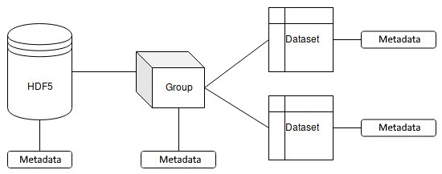

Data Processing
===============

HDF5 is a specialized file format for storing scientific data. This file format was developed to store heterogeneous multidimensional data with a complex structure. It provides fast access to single elements because it has optimized data structures for using secondary storage. Furthermore, HDF5 supports data compression. In general, this file format consists of named groups that contain multidimensional arrays of multitype data. Each element of this file format can contain metadata, as illustrated in the following diagram:

.. note::
   - The advantages of this format are its high read-and-write speed, fast access to distinct elements, and its ability to support data with a complex structure and various types of data.

   - Disadvantages are the requirement of specialized tools for editing and viewing by users, the limited support of type conversions among different platforms, and using a single file for the whole dataset.

.. warning::
   Further reading

   - The HDF5® library and file format: https://www.hdfgroup.org/solutions/hdf5/
   - GitHub link for Fast-CPPCSV Parser: https://github.com/ben-strasser/Fast-CPP-CSV-Parser
   - OpenCV: https://opencv.org/
   - Dlib C++ library: http://Dlib.net/
   - Flashlight documentation: https://fl.readthedocs.io/en/latest/index.html
   - nlohmann-json documentation: https://json.nlohmann.me/
   - mlpack documentation: https://mlpack.org/doc/index.html
   - A Hybrid Approach for Sentiment Analysis Applied to Paper Reviews dataset: https://archive.ics.uci.edu/static/public/410/paper+reviews.zip

