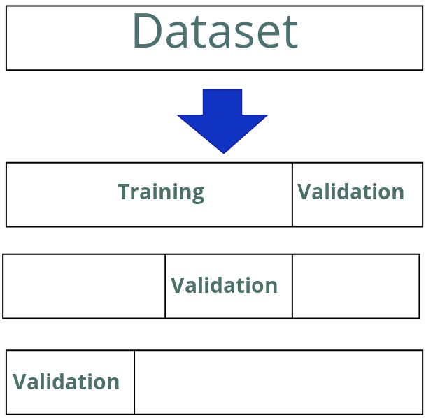

Measuring Performance and Selecting Models
==========================================

Performance metrics for ML models
---------------------------------

Regression Metrics
~~~~~~~~~~~~~~~~~~~~~
.. admonition:: **MSE** - quality

   **Mean Squared Error (MSE)** is a widely used metric for regression algorithms to estimate their quality.
   It represents the average of the squared differences between the predicted and the actual (ground truth) values.

   The formula for MSE is given by:

   .. math::

      \text{MSE} = \frac{1}{N} \sum_{i=1}^{N} (y_i - \hat{y}_i)^2

   Where:

   - :math:`N` is the total number of predictions (or data points)
   - :math:`y_i` is the ground truth (actual) value for the *i*-th item
   - :math:`\hat{y}_i` is the predicted value for the *i*-th item

   MSE is always non-negative, and a smaller MSE indicates better model performance.

.. admonition:: **RMSE** - performance

   **Root Mean Squared Error (RMSE)** is a commonly used metric for evaluating regression models.
   It is the square root of the Mean Squared Error (MSE) and provides an estimate of the
   average magnitude of prediction errors, expressed in the same units as the target variable.

   The formula for RMSE is given by:

   .. math::

      \text{RMSE} = \sqrt{\frac{1}{N} \sum_{i=1}^{N} (y_i - \hat{y}_i)^2}

   Where:

   - :math:`N` is the total number of predictions (or data points)
   - :math:`y_i` is the ground truth (actual) value for the *i*-th item
   - :math:`\hat{y}_i` is the predicted value for the *i*-th item

   RMSE penalizes larger errors more heavily than smaller ones due to the squaring operation.
   A lower RMSE value indicates a better fit between the model predictions and the actual values.

.. admonition:: **MAE** - quality

   Mean Absolute Error (MAE) is a commonly used metric for evaluating the performance of regression models.
   It measures the average magnitude of the errors between predicted and actual values, without considering their direction.
   In other words, it represents how far the predictions are from the true values on average. Which can be problematic in some cases. For example, if a model consistently underestimates or overestimates the true value, the MAE will still give a low score, even though the model may not be performing well. But this metric is more robust for outliers than RMSE.

   The formula for MAE is given by:

   .. math::

      \text{MAE} = \frac{1}{N} \sum_{i=1}^{N} |y_i - \hat{y}_i|

   Where:

   - :math:`N` is the total number of predictions (or data points)
   - :math:`y_i` is the ground truth (actual) value for the *i*-th item
   - :math:`\hat{y}_i` is the predicted value for the *i*-th item

   MAE is simple to interpret since it gives the average absolute difference between predictions and actual observations.
   A smaller MAE indicates a better model fit.

.. admonition:: **R-squared**

   R-squared (:math:`R^2`) measures how well a regression model explains the variability of the
   dependent variable. It compares the variance captured by the model with the total variance
   present in the data.

   It is defined in terms of two quantities:

   1. **Total Sum of Squares (SStot)** — measures the total variance in the data:

      .. math::

         SS_{tot} = \sum_i (y_i - \bar{y})^2

   2. **Residual Sum of Squares (SSres)** — measures the variance that is not explained by the model:

      .. math::

         SS_{res} = \sum_i (y_i - \hat{y}_i)^2

   The coefficient of determination is then calculated as:

   .. math::

      R^2 = 1 - \frac{SS_{res}}{SS_{tot}}

   Equivalently, this can be expressed as:

   .. math::

      R^2 = 1 -
      \frac{\frac{1}{n} \sum_{i=1}^{n} (y_i - \hat{y}_i)^2}
           {\frac{1}{n} \sum_{i=1}^{n} (y_i - \bar{y})^2}

   Where:

   - :math:`y_i` is the ground truth (actual) value for the *i*-th item
   - :math:`\hat{y}_i` is the predicted value for the *i*-th item
   - :math:`\bar{y}` is the mean of all ground truth values
   - :math:`n` is the total number of data points

   **Interpretation:**

   - :math:`R^2 = 1` → perfect prediction
   - :math:`R^2 = 0` → model predicts no better than the mean
   - :math:`R^2 < 0` → model performs worse than predicting the mean

.. admonition:: **Adjusted R-squared**

   Adjusted R-squared (:math:`\bar{R}^2`) is a modified version of the coefficient of determination (:math:`R^2`)
   that adjusts for the number of independent variables (predictors) in the model.
   It accounts for the possibility that simply adding more variables can artificially inflate the value of :math:`R^2`,
   even if those variables do not actually improve the model’s predictive power.

   The formula for Adjusted R-squared is given by:

   .. math::

      \bar{R}^2 = 1 - (1 - R^2) \frac{n - 1}{n - p - 1}

   Where:

   - :math:`R^2` is the coefficient of determination
   - :math:`n` is the number of observations (data points)
   - :math:`p` is the number of independent variables (predictors)

   **Interpretation:**

   - Adjusted R-squared increases only if the new predictor improves the model
     more than would be expected by chance.
   - If an added predictor does not contribute useful information,
     Adjusted R-squared will decrease.
   - A higher Adjusted R-squared indicates a model that fits the data better,
     while penalizing unnecessary model complexity.

   In general, Adjusted R-squared provides a more reliable measure than :math:`R^2` when comparing models with different numbers of predictors.

.. admonition:: **Classification metrics**

   Classification metrics are used to evaluate the performance of classification algorithms —
   models that assign input data to discrete categories (e.g., spam vs. not spam, positive vs. negative sentiment).

   These metrics quantify how well the predicted class labels match the true labels.

   A confusion matrix is a table that summarizes the performance of a classification model by comparing
   predicted and actual class labels.

   .. math::

      \begin{bmatrix}
      TP & FP \\
      FN & TN
      \end{bmatrix}

   Where:

   - **TP (True Positive):** correctly predicted positive instances
   - **TN (True Negative):** correctly predicted negative instances
   - **FP (False Positive):** negative instances incorrectly predicted as positive
   - **FN (False Negative):** positive instances incorrectly predicted as negative

   From this matrix, we can derive several key metrics.

.. admonition:: **Accuracy**

   Accuracy measures the overall correctness of the model:

   .. math::

      \text{Accuracy} = \frac{TP + TN}{TP + TN + FP + FN}

   It represents the proportion of correctly classified samples among all samples.
   In general, this metric is not very useful because it doesn’t show us the real picture in terms of cases with an odd number of classes. Let’s consider a spam classification task and assume we have 10 spam letters and 100 non-spam letters. Our algorithm predicted 90 of them correctly as non-spam and classified only 5 spam letters correctly. In this case, the accuracy = 86.4 However, if the algorithm predicts all letters as non-spam, then its accuracy should be 90.9. This is showing that our model doesn't work because it is unable to predict all spam letters, but the accuracy value is good enough.

.. admonition:: **Precision**, **Recall**

   Precision measures the proportion of correctly predicted positive instances
   among all instances predicted as positive:

   .. math::

      \text{Precision} = \frac{TP}{TP + FP}

   High precision indicates that the model produces few false positives.

   **Recall** (Sensitivity or True Positive Rate)

   Recall measures the proportion of actual positives that were correctly identified:

   .. math::

      \text{Recall} = \frac{TP}{TP + FN}

   High recall indicates that the model successfully detects most positive instances.

.. admonition:: **F-Score (F-Measure)**

   The F-score, also known as the F-measure, is a classification metric that combines **Precision**
   and **Recall** into a single value. It represents the harmonic mean of Precision and Recall,
   providing a balance between the two.

   The general formula for the F-score is:

   .. math::

      F_\beta = (1 + \beta^2) \times \frac{\text{Precision} \times \text{Recall}}
                                     {(\beta^2 \times \text{Precision}) + \text{Recall}}

   Where:

   - :math:`\text{Precision}` = :math:`\frac{TP}{TP + FP}`
   - :math:`\text{Recall}` = :math:`\frac{TP}{TP + FN}`
   - :math:`\beta` is a weighting factor that determines the importance of Recall relative to Precision

   **Special Cases**

   - **F1-Score:** when :math:`\beta = 1`, Precision and Recall are equally weighted:

     .. math::

        F_1 = 2 \times \frac{\text{Precision} \times \text{Recall}}
                          {\text{Precision} + \text{Recall}}

   - **F0.5-Score:** gives more weight to **Precision** than Recall.
   - **F2-Score:** gives more weight to **Recall** than Precision.

   Interpretation
   --------------

   - A **higher F-score** indicates better model performance in terms of balancing Precision and Recall.
   - F-score is especially useful when dealing with **imbalanced datasets**, where relying solely on Accuracy can be misleading.

   Comparison with Other Metrics
   -----------------------------

   - **Precision** alone ignores false negatives.
   - **Recall** alone ignores false positives.
   - **F-score** provides a single number that reflects both kinds of errors, making it suitable for tasks like information retrieval or medical diagnosis.

   **Macro**, **Micro**, and **Weighted Averages**

   For multi-class classification problems:

   - **Macro-average:** computes the metric independently for each class and takes the average (treats all classes equally).
   - **Micro-average:** aggregates the contributions of all classes to compute the metric globally.
   - **Weighted-average:** like macro-average but weights each class by its support (number of true instances).

.. admonition:: **AUC-ROC** (Under the Receiver Operating Characteristic Curve)

   The **Receiver Operating Characteristic (ROC)** curve and its associated **Area Under the Curve (AUC)**
   are important metrics for evaluating the performance of classification models, especially
   binary classifiers.

   ROC Curve
   ----------

   The ROC curve plots the **True Positive Rate (TPR)** against the **False Positive Rate (FPR)**
   at various classification thresholds.

   .. math::

      \text{TPR} = \frac{TP}{TP + FN}
      \qquad
      \text{FPR} = \frac{FP}{FP + TN}

   Where:

   - :math:`TP` — True Positives
   - :math:`TN` — True Negatives
   - :math:`FP` — False Positives
   - :math:`FN` — False Negatives

   The ROC curve shows the trade-off between sensitivity (recall) and specificity as the threshold varies.

   Area Under the Curve (AUC)
   --------------------------

   The **AUC** represents the area under the ROC curve, providing a single scalar value
   that summarizes the model’s ability to distinguish between positive and negative classes.

   .. math::

      \text{AUC} = \int_0^1 TPR(FPR) \, d(FPR)

   **Interpretation:**

   - :math:`AUC = 1.0` → perfect classification
   - :math:`AUC = 0.5` → random guessing
   - :math:`AUC < 0.5` → model performs worse than random guessing

   In practice, a higher AUC value indicates a better performing classifier across different threshold settings.

   Advantages
   ----------

   - AUC–ROC is **threshold-independent**, meaning it evaluates model performance across all classification thresholds.
   - Useful when the dataset is **imbalanced**, since it considers both the true positive rate and false positive rate.

   Limitations
   -----------

   - AUC–ROC can be **overly optimistic** when classes are highly imbalanced.
   - For such cases, the **Precision–Recall (PR) curve** and **AUC–PR** metric may provide a more informative view.

.. admonition:: **Log-Loss**

   Log-loss, also known as *cross-entropy loss*, is a performance metric
   commonly used in binary and multi-class classification problems. It
   measures the uncertainty of your predictions based on how far they
   are from the true labels. Lower log-loss indicates a better predictive
   model.

   Binary Log-Loss Function
   ------------------------

   For a binary classification problem, the log-loss for a single sample is
   defined as:

   .. math::

       L(y, p) = - \left[ y \log(p) + (1 - y) \log(1 - p) \right]

   Where:

   * ``y`` is the true label (0 or 1)
   * ``p`` is the predicted probability that ``y = 1``

   Average Log-Loss
   ----------------

   For ``N`` samples, the overall log-loss is:

   .. math::

       \text{LogLoss} = -\frac{1}{N} \sum_{i=1}^{N}
       \left[ y_i \log(p_i) + (1 - y_i) \log(1 - p_i) \right]

   Notes
   -----

   * Log-loss heavily penalizes confident but wrong predictions.
   * A perfect model achieves a log-loss of ``0``.
   * It works best when predictions are expressed as probabilities,
     not hard class labels.

Understanding bias and variance characteristics
-----------------------------------------------

Bias
~~~~

Bias is a prediction characteristic that tells us about the distance between model predictions and ground truth values. Usually, we use the term high bias or underfitting to say that model prediction is too far from the ground truth values, which means that the model generalization ability is weak.

.. admonition:: Regression model predictions with the polynomial degree equal to 1

   .. image:: images/3_3.jpg

   This graph shows the original values, the values used for validation, and a line that represents the polynomial regression model output. iIn this case, the polynomial degree is equal to 1. We can see that the predictied values do not describe the original data at all, so we can say that this model has a high bias. Also, we can plot validation metrics for each training cycle to get more information about the training process and the model's behavior.

   ** MAE metric values for the training process of the polynomial regression model**

   .. image:: images/3_4.jpg

   The lines for the metric values for the train and validation data are parllel and distant enough. Moreover, these lines do not change their direction after numerous training iterations. These facts also tell us that the model has a high bias because, for a regular training process, validation metric values should be close to the training values.

Variance
~~~~~~~~

Variance is a prediction characteristic that tells us about the variability of model predictions; in other words, how big the range of output values can be. Usually, we use the term high variance or overfitting in the case when a model tries to incorporate many training samples very precisely. In such a case, the model cannot provide a good approximation for new data but has excellent performance on the training data.

.. admonition:: Regression model predictions with the polynomial degree equal to 15

   .. image:: images/3_5.jpg
      The training data is indicated as Orig in the plot's legend, while the data used for validation is indicated as val in the plot's legend. We can see that these two sets of data - training data and validation data - are somehow distant from each other and that our model misses the validation data because of a lack of approximation.

   **MAE values for the learning process, Validation error**

   .. image:: images/3_6.jpg

   We can see that after approximately 75 learning iterations, the model began to predict training data much better, and the error value became lower. However, for the validation data, the MAE values began to increase. To deal with high variance, we can use special regularization techniques, which we will discuss in the following sections. We can also increase the number of training samples and decrease the number of features in one sample to reduce high variance.

Normal training
~~~~~~~~~~~~~~~~

Predictions when a model was trained ideally

   .. image:: images/3_7.jpg

Loss values when a model was trained ideally.

   .. image:: images/3_8.jpg

Regularization
~~~~~~~~~~~~~~~~
It is a technique that is used to reduce model overfitting.
2 main approaches:
   - Training data preprocessing. [ Add more distinct training samples. ]
   - Loss function modification. [ Modify the loss function thereby leading to significant variance. ]

.. admonition:: regularization – Lasso

   Lasso Regularization
   ===================

   Introduction
   ------------

   Lasso (Least Absolute Shrinkage and Selection Operator) is a regularization technique used in linear regression to prevent overfitting and improve model generalization. It works by adding a penalty to the absolute value of the coefficients. This encourages some coefficients to become exactly zero, effectively performing feature selection.

   Mathematical Formulation
   ------------------------

      The Lasso regression optimizes the following objective function:

      .. math::

          \text{Minimize} \quad
          \frac{1}{2n} \sum_{i=1}^{n} \left(y_i - \sum_{j=1}^{p} x_{ij} \beta_j \right)^2
          + \alpha \sum_{j=1}^{p} |\beta_j|

      Where:

      - :math:`n` is the number of samples
      - :math:`p` is the number of features
      - :math:`y_i` is the target value
      - :math:`x_{ij}` is the feature value
      - :math:`\beta_j` is the coefficient
      - :math:`\alpha` is the regularization parameter controlling the strength of the penalty

      Python Example
      --------------

      Here is a simple example of using Lasso regression in Python with scikit-learn:

      .. code-block:: python

          from sklearn.linear_model import Lasso
          from sklearn.model_selection import train_test_split
          from sklearn.datasets import load_boston

          # Load dataset
          X, y = load_boston(return_X_y=True)

          # Split into training and test sets
          X_train, X_test, y_train, y_test = train_test_split(X, y, test_size=0.2, random_state=42)

          # Initialize Lasso with alpha=0.1
          lasso = Lasso(alpha=0.1)

          # Fit model
          lasso.fit(X_train, y_train)

          # Print coefficients
          print("Lasso coefficients:", lasso.coef_)

          # Model score
          print("R^2 score:", lasso.score(X_test, y_test))

      Key Points
      ----------

      - Lasso can shrink some coefficients to exactly zero.
      - Useful for feature selection in high-dimensional datasets.
      - The regularization parameter :math:`\alpha` controls the strength of penalty.

.. admonition:: L2 regularization – Ridge

   Ridge Regularization
   ===================

   Introduction
   ------------

   Ridge regression, also known as L2 regularization, is a technique used to prevent overfitting in linear regression models by adding a penalty proportional to the square of the coefficients. Unlike Lasso, Ridge does not set coefficients to exactly zero but shrinks them towards zero, which is useful when all features are relevant.

   Mathematical Formulation
   ------------------------

   The Ridge regression objective function is:

   .. math::

       \text{Minimize} \quad
       \frac{1}{2n} \sum_{i=1}^{n} \left(y_i - \sum_{j=1}^{p} x_{ij} \beta_j \right)^2
       + \alpha \sum_{j=1}^{p} \beta_j^2

   Where:

   - :math:`n` is the number of samples
   - :math:`p` is the number of features
   - :math:`y_i` is the target value
   - :math:`x_{ij}` is the feature value
   - :math:`\beta_j` is the coefficient
   - :math:`\alpha` is the regularization parameter controlling the penalty strength

   Python Example
   --------------

   Here is a simple example of using Ridge regression in Python with scikit-learn:

   .. code-block:: python

       from sklearn.linear_model import Ridge
       from sklearn.model_selection import train_test_split
       from sklearn.datasets import load_boston

       # Load dataset
       X, y = load_boston(return_X_y=True)

       # Split into training and test sets
       X_train, X_test, y_train, y_test = train_test_split(X, y, test_size=0.2, random_state=42)

       # Initialize Ridge with alpha=1.0
       ridge = Ridge(alpha=1.0)

       # Fit model
       ridge.fit(X_train, y_train)

       # Print coefficients
       print("Ridge coefficients:", ridge.coef_)

       # Model score
       print("R^2 score:", ridge.score(X_test, y_test))

   Key Points
   ----------

   - Ridge shrinks coefficients but does not set them exactly to zero.
   - Useful when many small/medium effects contribute to the output.
   - The regularization parameter :math:`\alpha` controls the amount of shrinkage.

Data Augmentation
~~~~~~~~~~~~~~~~~~

This approach is common in computer vision (CV). When we can see that the model begins to overfit and does not have enough training data, we can augment the images we already have to increase the size of our dataset and provide more distinct training samples. Image augmentations are random image rotations, cropping and translations, mirroroing flips, scaling, and proportion changes. But it should be carefully designed for:
   - If the generated data is too similar to the original data, it can lead to overfitting.
   - It can introduce noise or artifacts into the dataset, which can degrade the quality of the ressulting models.
   - The augmented data may not accurately reflect the real-world distribution of data, leading to a domain shift between the training and test sets. THis can result in poor generalization performance.

Regularization for NNs
~~~~~~~~~~~~~~~~~~~~~~~
L1 and L2 regularizations are used to train NNs and called **Weight Decay**. Data augmentation also used in the training processes for NNs. **Drop out** is a pparticular type of regularization that was developed especially for NNs. It makes other nodes more insensitive to the weights of other nodes, which means the model becomes more rebust and stops overfitting.

Model selection with the grid search technique
----------------------------------------------

There are several approaches we can follow to choose the best set of hyperparameter values. The grid search technique is an automated approach for searching for the best hyperparameter values. It uses the cross-validation technique for model performance estimation.

Cross-validation
~~~~~~~~~~~~~~~~
**Limited or small training dataset**

If randomly sampling the validation data from original dataset leads to the following problems:
   - The size of the original dataset is reduced.(The original dataset is small enough, any reduce of the size could lead to big problems).

   - There is the probability of leaving data that is important for validation in the training part.

.. admonition:: How Cross-validation help on this?

   THe main idea behind it is to split the original dataset in such a way that all the data will be used for training the validation. Then, the training and validation proceses are performed for all partitions, and the resulting valiues are averaged.

The most well-known method of cross-validation is **K-fold**.
where K refers to the number of folds or partitions used to split the dataset The idea is to divide the dataset into K blocks of the same size. Then, we use one of the blocks for validation and the others for training. We repeat this process K times, each time choosing a different block for validation, and in the end, we average all the results. The data splitting scheme during the whole cross-validation cycle looks like this:

   - Divide the dataset into K blocks of the same size.
   - Select one of the blocks for validation and the remaining K-1 blocks for training.
   - Repeat this process, making sure that each block is used for validation and the rest are used for training.
   - Average the results of the performance metrics that were calculated for the validation sets on each iteration.

Grid search
~~~~~~~~~~~
**create a grid of the most reasonable hyperparameter values**

The grid is used to generate a reasonable number of distinct parameter sets quickly. We should have some prior knowledge about the task domain to initialize the minimum and maximum values for grid generation, or we can initialize the grid with some reasonable broad ranges. However, if the chosen ranges are too broad, the process of searching for parameters can take a long time and will require a significant amount of computational resources.

- **grid  search algorithm** chooses a set of hyperparameter values and trains a model.

- **Training step algorithm** uses the K-fold cross-validation to estimate model performance.
   - We should also define a single model performance estimation metric for model comparison that the algorithm will calculate at each training step for every model.

- After completing the model training process with each set of parameters from every grid cell, the algorithm chooses the best set of hyperparameter values by comparing the metric’s values and selecting the best one. Usually, the set with the smallest value is the best one.

mlpack example
~~~~~~~~~~~~~~
The mlpack library contains a special HyperParameterTuner class to do hyperparameter searches with different algorithms in both discrete and continuous spaces. The default search algorithm is grid search.

Let’s define a HyperParameterTuner object to search for the best regularization value for the linear ridge regression algorithm. The definition will be the following:

.. code-block:: c++

   double validation_size = 0.2;
   HyperParameterTuner<LinearRegression,
     MSE,
     SimpleCV> parameters_tuner(
       validation_size, samples, labels);

how we can generate a training dataset for these examples. It will take the two following steps:

- Generating data that follows some predefined pattern—for example, 2D normally distributed points, plus some noise
- Data normalization

**Armadillo library - mlpack**

.. code-block:: c++

   std::pair<arma::mat, arma::rowvec> GenerateData( //mat is a matrix, rowvect is a 1*n matrix
   size_t num_samples) {
   arma::mat samples = arma::randn<arma::mat>(1, num_samples); // this mat is 1 * num_samples matrix [1,2,3...]
   arma::rowvec labels = samples + arma::randn<arma::rowvec>(
    num_samples, arma::distr_param(1.0, 1.5)); // mean = 1.0, stddev = 1.5
   return {samples, labels};
   }
   ...
   size_t num_samples = 1000;
   auto [raw_samples, raw_labels] = GenerateData(num_samples);

for samples, we used the arma::mat type, and for labels, the arma::rowvec type. So, samples are placed into the matrix entity and labels into a one-dimensional vector correspondingly. Also, we used the arma::randn function to generate normally distributed data and noise.

**Normalize data**

.. code-block:: cpp

   //StandardScaler from mlpack

   data::StandardScaler sample_scaler;
   sample_scaler.Fit(raw_samples); //Function to fit features, to find out the min max and scale.
   arma::mat samples(1, num_samples);
   sample_scaler.Transform(raw_samples, samples); //input=raw_samples, output=samples, adjust with sample_scaler.
   data::StandardScaler label_scaler;
   label_scaler.Fit(raw_labels);
   arma::rowvec labels(num_samples);
   label_scaler.Transform(raw_labels, labels);

**how to prepare the data and how to define the hyperparameter tuner object**

.. code-block:: cpp

   // grid search

   arma::vec lambdas{0.0, 0.001, 0.01, 0.1, 1.0};
   double best_lambda = 0;
   std::tie(best_lambda) = parameters_tuner.Optimize(lambdas); //return a tuple

   LinearRegression& linear_regression =  parameters_tuner.BestModel();

   size_t num_new_samples = 50;
   arma::dvec new_samples_values = arma::linspace<arma::dvec>( //dvec - double vector. arma::linspace function to get a linearly distributed range of data
                  x_minmax.first,
                  x_minmax.second,
                  num_new_samples); //linspace- from first to second, total steps is num_new_samples.
   arma::mat new_samples(1, num_new_samples);
   new_samples.row(0) = arma::trans(new_samples_values); //additional code that transforms this vector into a matrix object
   arma::mat norm_new_samples(1, num_new_samples);
   sample_scaler.Transform(new_samples, norm_new_samples);

How to use the model with the best parameter we found with the grid search:

.. code-block:: cpp

   arma::rowvec predictions(num_new_samples);
   linear_regression.Predict(norm_new_samples, predictions);

Optuna with Flashlight example
------------------------------

There is no support for any hyperparameter tuning algorithms in the Flashlight library, but we can use an external tool named Optuna to deal with ML programs that we want to search the best hyperparameters for. The main idea is to use some **inter-process communication (IPC)** approach to run training with different parameters and get some performance metric values after training.

Optuna also has a **command-line interface (CLI)** that can be used with tools that don’t support Python. Another way to use such tools is to call them from Python, passing their command-line parameters and reading their standard output.

To use Optuna for hyperparameter tuning, we need to complete the three following stages:
   - Define an objective function for optimization.
   - Create a study object.
   - Run optimization process.

.. code-block:: python

   import optuna
   import subprocess

   def objective(trial: optuna.trial.Trial):

      #Trial class object that contains a set of hyperparameter distributions
      #The suggest_float method samples from a continuous space, and the suggest_int method samples from a discrete space.

      lr = trial.suggest_float("learning_rate", low=0.01, high=0.05)
      d = trial.suggest_int("polynomial_degree", low=16, high=64)
      bs = trial.suggest_int("batch_size", low=16, high=64)
      result = subprocess.run(
         [bibnary_path, str(d), str(lr), str(bs)],
         stdout = subprocess.PIPE)
      mse = float(result.stddout)
      return mse

