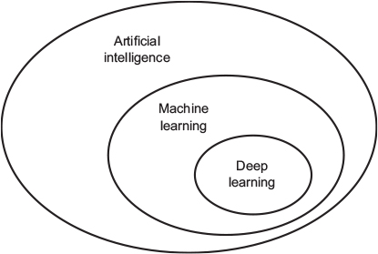

Chapter 1. What is deep learning?
=================================

1. Artificial intelligence

.. note::
   the effort to automate intellectual tasks normally performed by humans. As such, AI is a general field that encompasses machine learning and deep learning, but that also includes many more approaches that don’t involve any learning.

