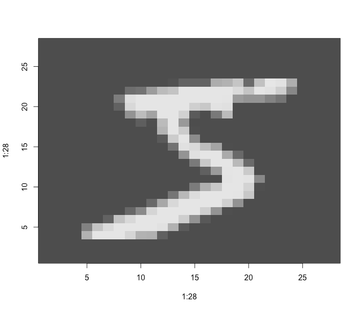

Chapter 2. Before we begin: the mathematical building blocks of neural networks
===============================================================================

Start with MNIST dataset in Keras. (Of course!)

.. code-block:: R

   library(keras3)

   # Loading the MNIST dataset from Keras3
   mnist <- dataset_mnist()

   str(mnist)

   train_images <- mnist$train$x
   # int [1:60000, 1:28, 1:28] 0 0 0 0 0 0 0 0 0 0 ...
   train_labels <- mnist$train$y
   # int [1:60000(1d)] 5 0 4 1 9 2 1 3 1 4 ...

   test_images <- mnist$test$x
   test_labels <- mnist$test$y

   str(train_labels)

Getting ready for the dataset: the training and testing images and labels.

Check out one of the image:

.. code-block:: R

   image(
     1:28,
     1:28,
     t(apply(train_images[1, , ], 2, rev)),
     col = gray.colors(256)
   )

