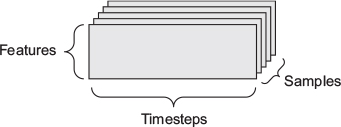
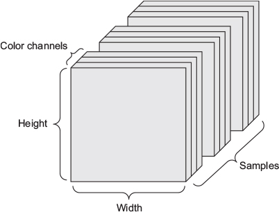

Chapter 2. Before we begin: the mathematical building blocks of neural networks
===============================================================================

Start with MNIST dataset in Keras. (Of course!)
------------------------------------------------

.. code-block:: R

   library(keras3)

   # Loading the MNIST dataset from Keras3
   mnist <- dataset_mnist()

   str(mnist)

   train_images <- mnist$train$x
   # int [1:60000, 1:28, 1:28] 0 0 0 0 0 0 0 0 0 0 ...
   train_labels <- mnist$train$y
   # int [1:60000(1d)] 5 0 4 1 9 2 1 3 1 4 ...

   test_images <- mnist$test$x
   test_labels <- mnist$test$y

   str(train_labels)

Getting ready for the dataset: the training and testing images and labels.

Check out one of the image:

.. code-block:: R

   image(
     1:28,
     1:28,
     t(apply(train_images[1, , ], 2, rev)),
     col = gray.colors(256)
   )

.. image:: c2/1.png

The network architecture

.. code-block:: R

   network <- keras_model_sequential() %>%
     layer_dense(units = 512, activation = "relu", input_shape = c(28 * 28)) %>%
     layer_dense(units = 10, activation = "softmax")

.. note::

   - A loss function — How the network will be able to measure its performance on the training data, and thus how it will be able to steer itself in the right direction.
   - An optimizer — The mechanism through which the network will update itself based on the data it sees and its loss function.
   - Metrics to monitor during training and testing — Here, we’ll only care about accuracy (the fraction of the images that were correctly classified).

The compilation step

.. code-block:: R

   network %>% compile(
     optimizer = "rmsprop", # gradient-based optimizer
     loss = "categorical_crossentropy",
     metrics = c("accuracy")
   )

- Optimizer（优化器）负责： 根据模型犯的错误，调整 weights。
- Loss function（损失函数）负责衡量：模型的预测到底有多错?

Preparing the image data.

.. code-block:: R

   train_images <- array_reshape(train_images, c(60000, 28 * 28)) # reshape a Matrix into an array.
   train_images <- train_images / 255 # Normalization

   test_images <- array_reshape(test_images, c(10000, 28 * 28))
   test_images <- test_images / 255

Preparing the labels.

.. code-block:: R

   train_labels <- to_categorical(train_labels)
   test_labels <- to_categorical(test_labels)

.. important:: Why we need this step?

   Our output layer looks like : [0.01, 0.02, 0.01, 0.03, 0.02, 0.85, 0.01, 0.02, 0.02, 0.03] -> prediction is 5. (0.85). VS Actual: [0, 0, 0, 0, 0, 1, 0, 0, 0, 0], then optimizer will change weights base on this loss. Moreover, we choosed "categorical_crossentropy" as loss function from beginning.

RUN

.. code-block:: R

   network %>% fit(train_images, train_labels, epochs = 5, batch_size = 128)
   /*
   Epoch 1/5
   469/469 ━━━━━━━━━━━━━━━━━━━━ 1s 2ms/step - accuracy: 0.9222 - loss: 0.2688
   469/469 ━━━━━━━━━━━━━━━━━━━━ 1s 2ms/step - accuracy: 0.9222 - loss: 0.2688
   Epoch 2/5
   469/469 ━━━━━━━━━━━━━━━━━━━━ 1s 2ms/step - accuracy: 0.9673 - loss: 0.1102
   469/469 ━━━━━━━━━━━━━━━━━━━━ 1s 2ms/step - accuracy: 0.9673 - loss: 0.1102
   Epoch 3/5
   469/469 ━━━━━━━━━━━━━━━━━━━━ 1s 2ms/step - accuracy: 0.9785 - loss: 0.0715
   469/469 ━━━━━━━━━━━━━━━━━━━━ 1s 2ms/step - accuracy: 0.9785 - loss: 0.0715
   Epoch 4/5
   469/469 ━━━━━━━━━━━━━━━━━━━━ 1s 2ms/step - accuracy: 0.9844 - loss: 0.0517
   469/469 ━━━━━━━━━━━━━━━━━━━━ 1s 2ms/step - accuracy: 0.9844 - loss: 0.0517
   Epoch 5/5
   469/469 ━━━━━━━━━━━━━━━━━━━━ 1s 2ms/step - accuracy: 0.9884 - loss: 0.0390
   469/469 ━━━━━━━━━━━━━━━━━━━━ 1s 2ms/step - accuracy: 0.9884 - loss: 0.0390 */

   metrics <- network %>% evaluate(test_images, test_labels)
   metrics
   /*
   $accuracy
   [1] 0.9811

   $loss
   [1] 0.06619187
   */

Data representations for neural networks
----------------------------------------

- What is a tensor?
Tensors are a generalization of vectors and matrices to an arbitrary number of dimensions (note that in the context of tensors, a *dimension* is often called an *axis*). In R, vectors are used to create and manipulate 1D tensors, and matrices are used for 2D tensors. For higher-level dimensions, *array* objects (which support any number of dimensions) are used.

.. note:: Real-world examples of data tensors

   - Vector data—2D tensors of shape (samples, features).
   - Timeseries data or sequence data—3D tensors of shape (samples, timesteps, features).
   - Images—4D tensors of shape (samples, height, width, channels) or (samples, channels, height, width).
   - Video—5D tensors of shape (samples, frames, height, width, channels) or (samples, frames, channels, height, width).

Vector data
~~~~~~~~~~~

This is the most common case. In such a dataset, each single data point can be encoded as a vector, and thus a batch of data will be encoded as a 2D tensor (that is, an array of vectors), where the first axis is the samples axis and the second axis is the features axis.

Timeseries data or sequence data
~~~~~~~~~~~~~~~~~~~~~~~~~~~~~~~~~

Whenever time matters in your data (or the notion of sequence order), it makes sense to store it in a 3D tensor with an explicit time axis. Each sample can be encoded as a sequence of vectors (a 2D tensor), and thus a batch of data will be encoded as a 3D tensor.

.. important::

   The time axis is always the second axis, by convention.

- 1. A dataset of stock prices. Every minute, we store the current price of the stock, the highest price in the past minute, and the lowest price in the past minute. Thus, every minute is encoded as a 3D vector, an entire day of trading is encoded as a 2D tensor of shape (390, 3) (there are 390 minutes in a trading day), and 250 days’ worth of data can be stored in a 3D tensor of shape (250, 390, 3). Here, each sample would be one day’s worth of data.

- 2. A dataset of tweets, where we encode each tweet as a sequence of 140 characters out of an alphabet of 128 unique characters. In this setting, each character can be encoded as a binary vector of size 128 (an all-zeros vector except for a 1 entry at the index corresponding to the character). Then each tweet can be encoded as a 2D tensor of shape (140, 128), and a dataset of 1 million tweets can be stored in a tensor of shape (1000000, 140, 128).

Image data
~~~~~~~~~~

Images typically have three dimensions: height, width, and color depth. Although grayscale images (like our MNIST digits) have only a single color channel and could thus be stored in 2D tensors, by convention image tensors are always 3D, with a one-dimensional color channel for grayscale images. A batch of 128 grayscale images of size 256 × 256 could thus be stored in a tensor of shape (128, 256, 256, 1), and a batch of 128 color images could be stored in a tensor of shape (128, 256, 256, 3).

There are two conventions for shapes of images tensors:

- the channels-last convention (used by TensorFlow).(samples, height, width, color_depth)

- the channels-first convention (used by Theano).(samples, color_depth, height, width)

Video data
~~~~~~~~~~~
Video data is one of the few types of real-world data for which you’ll need 5D tensors. A video can be understood as a sequence of frames, each frame being a color image. Because each frame can be stored in a 3D tensor (height, width, color_depth), a sequence of frames can be stored in a 4D tensor (frames, height, width, color_depth), and thus a batch of different videos can be stored in a 5D tensor of shape (samples, frames, height, width, color_depth).

For instance, a 60-second, 144 × 256 YouTube video clip sampled at 4 frames per second would have 240 frames. A batch of four such video clips would be stored in a tensor of shape (4, 240, 144, 256, 3). That’s a total of 106,168,320 values! If the data type of the tensor is double, then each value is stored in 64 bits, so the tensor would represent 810 MB. Heavy! Videos you encounter in real life are much lighter, because they aren’t stored as double and they’re typically compressed by a large factor (such as in the MPEG format).

Element-wise operations
~~~~~~~~~~~~~~~~~~~~~~~~

relu

.. code-block:: R

   naive_relu <- function(x){
      for (i in nrow(x)) {
         for (j in ncol(x){
         x[i, j] <- max(x[i, j], 0)
         }
      }
      x
   }

In practice, when dealing with R arrays, these operations are available as well-optimized built-in R functions, which themselves delegate the heavy lifting to a BLAS implementation (Basic Linear Algebra Subprograms) if you have one installed (which you should). BLAS are low-level, highly parallel, efficient tensor-manipulation routines typically implemented in Fortran or C.

.. code-block:: R

   z <- x + y                1
   z <- pmax(z, 0)           2
   # 1. Element-wise addition
   # 2. Element-wise relu

Operations involving tensors of different dimensions
~~~~~~~~~~~~~~~~~~~~~~~~~~~~~~~~~~~~~~~~~~~~~~~~~~~~

The R sweep() function enables you to perform operations between higher-dimension tensors and lower-dimension tensors. With sweep(), we could perform the matrix plus vector addition described earlier as follows:

.. code-block:: R

   sweep(x, 2, y, `+`)