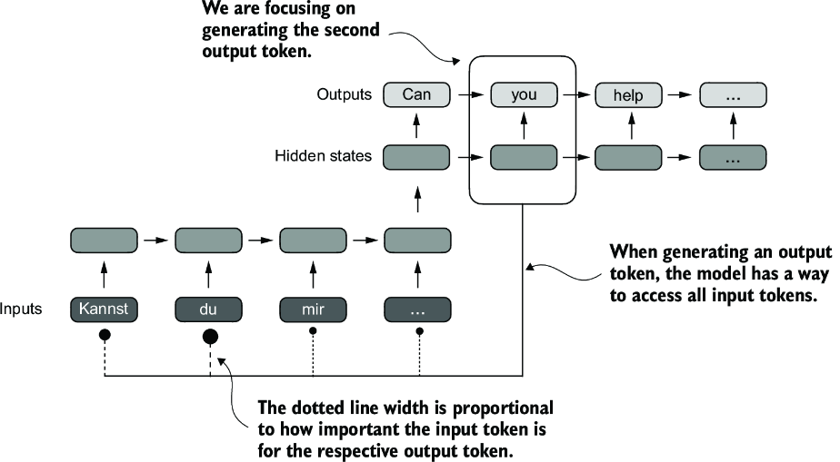

CHATPER 3 Coding attention mechanisms
=====================================

3.1 The problem with modeling long sequence
-------------------------------------------

The reasons for using attention mechanisms in neural networks

.. image:: c3/1.png
   :alt: Description of the image
   :width: 600px

We will implement 4 different variants of attention machanism, These different attention variants build on each other. The goal is to arrive at a compact and efficient implementation fo multi-head attention that we can plug into the LLM.

.. image:: c3/2.png
   :alt: Description of the image
   :width: 600px
it’s not possible to merely translate word by word. Instead, the translation process requires contextual understanding and grammatical alignment.

.. image:: c3/3.png
   :alt: Description of the image
   :width: 600px

To address this problem, it is common to use a deep neural network with two submodules, an encoder and a decoder.

.. image:: c3/4.png
   :alt: Description of the image
   :width: 600px

Before the advent of transformer models, encoder–decoder RNNs were a popular choice for machine translation. The encoder takes a sequence of tokens from the source language as input, where a hidden state (an intermediate neural network layer) of the encoder encodes a compressed representation of the entire input sequence. Then, the decoder uses its current hidden state to begin the translation, token by token.

The big limitation of encoder–decoder RNNs is that the RNN can’t directly access earlier hidden states from the encoder during the decoding phase. Consequently, it relies solely on the current hidden state, which encapsulates all relevant information. This can lead to a loss of context, especially in complex sentences where dependencies might span long distances.

3.2 Cpaturing data dependencies with attention mechanisms
---------------------------------------------------------

attention mechanism, the text-generating decoder part of the network can access all input tokens selectively. This means that some input tokens are more important than others for generating a given output token. The importance is determined by the attention weights

only three years later, researchers found that RNN architectures are not required for building deep neural networks for natural language processing and proposed the original transformer architecture.

Self-attention is a mechanism that allows each position in the input sequence to consider the relevancy of, or “attend to,” all other positions in the same sequence when computing the representation of a sequence. Self-attention is a key component of contemporary LLMs based on the transformer architecture, such as the GPT series.

.. image:: c3/6.png
   :alt: Description of the image
   :width: 600px

Self-attention is a mechanism in transformers used to compute more efficient input representations by allowing each position in a sequence to interact with and weight the importance of all other positions within the same sequence.

3.3 Attending to different parts of the input with self-attention.
------------------------------------------------------------------
The “self” refers to the mechanism’s ability to compute attention weights by relating different positions within a single input sequence.

3.3.1 A simple self-attention mechanism without trainable weights.
~~~~~~~~~~~~~~~~~~~~~~~~~~~~~~~~~~~~~~~~~~~~~~~~~~~~~~~~~~~~~~~~~~

.. image:: c3/7.png
   :alt: Description of the image
   :width: 600px

The goal of self-attention is to compute a context vector for each input element that combines information from all other input elements. In this example, we compute the context vector z(2). The importance or contribution of each input element for computing z(2) is determined by the attention weights a21 to a2T. When computing z(2), the attention weights are calculated with respect to input element x(2) and all other inputs.

.. tip::
   Context vectors play a crucial role in self-attention. Their purpose is to create enriched representations of each element in an input sequence (like a sentence) by incorporating information from all other elements in the sequence.

.. code-block:: python

   import torch
   inputs = torch.tensor(
     [[0.43, 0.15, 0.89], # Your     (x^1)
      [0.55, 0.87, 0.66], # journey  (x^2)
      [0.57, 0.85, 0.64], # starts   (x^3)
      [0.22, 0.58, 0.33], # with     (x^4)
      [0.77, 0.25, 0.10], # one      (x^5)
      [0.05, 0.80, 0.55]] # step     (x^6)
   )

.. image:: c3/8.png
   :alt: Description of the image
   :width: 600px

.. admonition:: 🔰 1. The first step: Compute the intermediate values w (Attention scores)

   Why we not use the token embedding?
   0.87 is truncated to 0.8. In this truncated version, the embeddings of the words “journey” and “starts” may appear similar by random chance.

.. code-block:: python

   # calculate the intermediate attention scores between the query token and each input token.
   # We determine these scores by computing the dot product of the query, x(2), with every other input token:

   second_word_query_token = inputs[1] # the second word's token
   attention_score_to_second_word = torch.empty(inputs.shape[0]) # same shape with the first dim [6] of inputs [6, 3] but with uninitialized data
   for num_index, matrix in enumerate(inputs):
     attention_score_to_second_word[num_index] = torch.dot(matrix, second_word_query_token)

   attention_score_to_second_word

   #tensor([0.9544, 1.4950, 1.4754, 0.8434, 0.7070, 1.0865])

.. tip::

   the dot product is a measure of similarity because it quantifies how closely two vectors are aligned: a higher dot product indicates a greater degree of alignment or similarity between the vectors. In the context of self-attention mechanisms, the dot product determines the extent to which each element in a sequence focuses on, or “attends to,” any other element: the higher the dot product, the higher the similarity and attention score between two elements.

.. admonition:: 🔰 2. The second step: Nomalize the weights.

   This normalization is a convvention that is useful for interpretation and maintaining training stability in an LLM.

.. image:: c3/9.png
   :alt: Description of the image
   :width: 600px

.. code-block:: python

   sum_of_weights = attention_score_to_second_word.sum()
   normalize_weights = attention_score_to_second_word / sum_of_weights
   normalize_weights

   # tensor([0.1385, 0.2379, 0.2333, 0.1240, 0.1082, 0.1581])

.. tip::

   The results are bit difference.

   - tensor([0.1455, 0.2278, 0.2249, 0.1285, 0.1077, 0.1656])
   - tensor([0.1385, 0.2379, 0.2333, 0.1240, 0.1082, 0.1581])
   It becauses the Softmax takes exponation of each value. Softmax = exp(tensor_i) / sum (exp (tensor)) Make difference more obviously.

.. admonition:: 🔰 3. Calculating the context vector z(2)

   by **multiplying** the embedded input tokens x(i), with the corresponding weights and then **summing** the resulting vecetors.

.. image:: c3/10.png
   :alt: Description of the image
   :width: 600px

.. code-block:: python

   # Context vector for input 2
   # the context vector should have same shape with the query's shape.
   #从inputs encoded 变成 context vector, 目的是通过dim不变的情况下,让所有的vector之间通过weights产生连接.
   query = inputs[1]

   context_vector_v2 = torch.zeros(query.shape)
   for idx, matrix in enumerate(inputs):
     context_vector_v2 += matrix * softmax_result[idx]

   context_vector_v2

   # tensor([0.4419, 0.6515, 0.5683])

3.3.2 Computing attention weights for all input tokens
~~~~~~~~~~~~~~~~~~~~~~~~~~~~~~~~~~~~~~~~~~~~~~~~~~~~~~

.. tip::

   COMPUTE ATTENTION SCORES。=> matrix @ matrix.T

.. admonition:: 🔰 3-steps:

   - Token embedding for each of them.
   - Weight
   - Context Vector

.. code-block:: python

   # Dot product for each 1-1 2-1 3-1 ...2-1 2-2 3-2...6-6

   len_words = inputs.shape[0]
   attention_score_matrix = torch.empty(len_words, len_words)
   for row_index, row_value in enumerate(inputs):
     for col_index, cal_value in enumerate(inputs):
       attention_score_matrix[row_index, col_index] = torch.dot(row_value, cal_value)

   attention_score_matrix

   '''
   tensor([[0.9995, 0.9544, 0.9422, 0.4753, 0.4576, 0.6310],
        [0.9544, 1.4950, 1.4754, 0.8434, 0.7070, 1.0865],
        [0.9422, 1.4754, 1.4570, 0.8296, 0.7154, 1.0605],
        [0.4753, 0.8434, 0.8296, 0.4937, 0.3474, 0.6565],
        [0.4576, 0.7070, 0.7154, 0.3474, 0.6654, 0.2935],
        [0.6310, 1.0865, 1.0605, 0.6565, 0.2935, 0.9450]])
   '''

   # Faster process for Dot product
   # matrix @ matrix.T
   attention_score_matrix = inputs @ inputs.T
   attention_score_matrix

   '''
   tensor([[0.9995, 0.9544, 0.9422, 0.4753, 0.4576, 0.6310],
        [0.9544, 1.4950, 1.4754, 0.8434, 0.7070, 1.0865],
        [0.9422, 1.4754, 1.4570, 0.8296, 0.7154, 1.0605],
        [0.4753, 0.8434, 0.8296, 0.4937, 0.3474, 0.6565],
        [0.4576, 0.7070, 0.7154, 0.3474, 0.6654, 0.2935],
        [0.6310, 1.0865, 1.0605, 0.6565, 0.2935, 0.9450]])
   '''

   normalize_weights = torch.softmax(attention_score_matrix, dim=-1)
   normalize_weights

   '''
   tensor([[0.2098, 0.2006, 0.1981, 0.1242, 0.1220, 0.1452],
        [0.1385, 0.2379, 0.2333, 0.1240, 0.1082, 0.1581],
        [0.1390, 0.2369, 0.2326, 0.1242, 0.1108, 0.1565],
        [0.1435, 0.2074, 0.2046, 0.1462, 0.1263, 0.1720],
        [0.1526, 0.1958, 0.1975, 0.1367, 0.1879, 0.1295],
        [0.1385, 0.2184, 0.2128, 0.1420, 0.0988, 0.1896]])
   '''

3.4 Implementing self-attention with trainable weights
------------------------------------------------------

3.4.1 Computing the attention weights step by step
~~~~~~~~~~~~~~~~~~~~~~~~~~~~~~~~~~~~~~~~~~~~~~~~~~

.. code-block:: python

   inputs

   '''
   tensor([[0.4300, 0.1500, 0.8900],
           [0.5500, 0.8700, 0.6600],
           [0.5700, 0.8500, 0.6400],
           [0.2200, 0.5800, 0.3300],
           [0.7700, 0.2500, 0.1000],
           [0.0500, 0.8000, 0.5500]])

.. admonition:: 🔰 Trainable weight matrices: Wq, Wk, and Wv.

   In the first step of the self-attention mechanism with trainable weight matrices, we compute query (q), key (k), and value (v) vectors for input elements x. Similar to previous sections, we designate the second input, x(2), as the query input. The query vector q(2) is obtained via matrix multiplication between the input x(2) and the weight matrix Wq. Similarly, we obtain the key and value vectors via matrix multiplication involving the weight matrices Wk and Wv.

   Example, We start by computing only one context vector, z2, for illustration purposes. Just like the image.

.. admonition:: 🔰 Step - 1

   Compute the query, key and value vectors

.. code-block:: python

   '''
   the input and output dimensions are usually the same,
   but to better follow the computation, we’ll use different。
   '''
   x_2 = inputs[1]
   dim_in = inputs.shape[1]
   dim_out = 2

   '''
   Initialize Wq, Wk, Wv
   '''
   torch.manual_seed(123)
   W_query = torch.nn.Parameter(torch.rand(d_in, d_out), requires_grad=False)
   W_key   = torch.nn.Parameter(torch.rand(d_in, d_out), requires_grad=False)
   W_value = torch.nn.Parameter(torch.rand(d_in, d_out), requires_grad=False)

   '''
   Compute the query, key and value vectors, as showing in the image.
   '''
   query_2 = x_2 @ W_query
   key_2 = x_2 @ W_key
   value_2 = x_2 @ W_value

   key_2, W_query.shape

   # (tensor([0.4433, 1.1419]), torch.Size([3, 2]))

   keys = inputs @ W_key
   values = inputs @ W_value

   keys, values

   '''
   (tensor([[0.3669, 0.7646],
         [0.4433, 1.1419],
         [0.4361, 1.1156],
         [0.2408, 0.6706],
         [0.1827, 0.3292],
         [0.3275, 0.9642]]),
    tensor([[0.1855, 0.8812],
            [0.3951, 1.0037],
            [0.3879, 0.9831],
            [0.2393, 0.5493],
            [0.1492, 0.3346],
            [0.3221, 0.7863]]))
   '''

.. tip::

   Weight parameters vs. attention weights weight parameters are the fundamental, learned coefficients that define the network’s connections, while attention weights are dynamic, context-specific values.

   - Weight Parameters = model’s permanent knowledge
   - Attention Weights = model’s temporary focus on a specific input

.. admonition:: 🔰 Step - 2

   Computing the attention scores.

.. image:: c3/15.png

.. code-block:: python

   '''
   Attention score for x2
   '''
   w2 = query_2.dot(key_2)

   '''
   Generalize this computation to all attention scores via matrix mulitiplication:
   1*3 @ 3*6 = 1*6
   '''
   attention_score_2 = query_2 @ keys.T
   attention_score_2

   '''
   Go from attention scores to the attention Weights.
   Scale the attention scores by dividing them by the square root of the embedding dimension of the keys
   '''
   d_k = keys.shape[-1] # 2
   attention_weights_2 = torch.softmax(attention_score_2 / d_k ** 0.5, dim = -1)
   w2, attention_score_2, attention_weights_2

   '''
   (tensor(1.8524),
    tensor([1.2705, 1.8524, 1.8111, 1.0795, 0.5577, 1.5440]),
    tensor([0.1500, 0.2264, 0.2199, 0.1311, 0.0906, 0.1820]))
   '''

.. image:: c3/16.png

.. tip::

   *The rationale behind scaled-dot product attention*

   The reason for the normalization by the embedding dimension size is to improve the training performance by avoiding small gradients. For instance, when scaling up the embedding dimension, which is typically greater than 1,000 for GPT-like LLMs, large dot products can result in very small gradients during backpropagation due to the softmax function applied to them. As dot products increase, the softmax function behaves more like a step function, resulting in gradients nearing zero. These small gradients can drastically slow down learning or cause training to stagnate.

   The scaling by the square root of the embedding dimension is the reason why this self-attention mechanism is also called scaled-dot product attention.

.. admonition:: 🔰 Final step

   Compute the context vectors.

.. code-block:: python

   context_vector = attention_weights_2 @ values
   context_vector, attention_weights_2.shape, values.shape

   #(tensor([0.3061, 0.8210]), torch.Size([6]), torch.Size([6, 2]))

.. danger::
   REMEMBER THIS IS ONLY FOR A SINGLE CONTEXT VECTOR x_2

.. admonition:: 🔰 Why Query, Key and Value?

   The terms “key,” “query,” and “value” in the context of attention mechanisms are borrowed from the domain of information retrieval and databases, where similar concepts are used to store, search, and retrieve information.

   - A query is analogous to a search query in a database. It represents the current item (e.g., a word or token in a sentence) the model focuses on or tries to understand. The query is used to probe the other parts of the input sequence to determine how much attention to pay to them.

   - The key is like a database key used for indexing and searching. In the attention mechanism, each item in the input sequence (e.g., each word in a sentence) has an associated key. These keys are used to match the query.

   - The value in this context is similar to the value in a key-value pair in a database. It represents the actual content or representation of the input items. Once the model determines which keys (and thus which parts of the input) are most relevant to the query (the current focus item), it retrieves the corresponding values.

3.4.2 Implementing a compact self-attention Python class
~~~~~~~~~~~~~~~~~~~~~~~~~~~~~~~~~~~~~~~~~~~~~~~~~~~~~~~~

.. code-block:: python

   import torch.nn as nn
   class SelfAttention_v1(nn.Module):
     def __init__(self, dim_in, dim_out) -> None:
       super().__init__()
       self.W_query = nn.Parameter(torch.rand(dim_in, dim_out))
       self.W_key = nn.Parameter(torch.rand(dim_in, dim_out))
       self.W_value = nn.Parameter(torch.rand(dim_in, dim_out))

     def forward(self, query_focus):
       keys = query_focus @ self.W_key
       queries = query_focus @ self.W_query
       values = query_focus @ self.W_value
       attention_scores = queries @ keys.T
       attention_weights = torch.softmax(attention_scores / keys.shape[-1] ** 0.5, dim = -1)
       context_vec = attention_weights @ values
       return context_vec

   '''
   Let's check
   '''
   dim_in, dim_out
   torch.manual_seed(123)
   v1_module = SelfAttention_v1(dim_in, dim_out)
   v1_module(inputs)

   '''
   tensor([[0.2996, 0.8053],
        [0.3061, 0.8210],
        [0.3058, 0.8203],
        [0.2948, 0.7939],
        [0.2927, 0.7891],
        [0.2990, 0.8040]], grad_fn=<MmBackward0>)
   '''
Steps:

- Input vectors -> Input Matrix X [tiktoken, window slider, Token embedding]
- Wq, Wk, Wv. query_x @ [torch.nn.Parameter(torch.rand(dim_in, dim_out), requires_grad=False)] ->  Q, K, V
- attention_score = Q@ K.T
   -> attention_weight = torch.softmax(attention_score / keys.shape[-1] ** 0.5, dim=-1)

   -> context_vector = attention_weight @ V

.. admonition:: A self-attention class using Pytorch linear layers:

   .. code-block:: python

      class SelfAttention_v2(nn.Module):
        def __init__(self, d_in, d_out, qkv_bias=False):
          super().__init__()
          self.w_query = nn.Linear(d_in, d_out, bias=qkv_bias)
          self.w_key = nn.Linear(d_in, d_out, bias=qkv_bias)
          self.w_value = nn.Linear(d_in, d_out, bias=qkv_bias)

        def forward(self, x):
          keys = self.w_key(x)
          queries = self.w_query(x)
          values = self.w_value(x)
          attention_scores = queries @ keys.T
          attention_weights = torch.softmax(attention_scores / keys.shape[-1] ** 0.5, dim=-1)
          context_vecter = attention_weights @ values
          return context_vecter

      # class SelfAttention_v1(nn.Module):
      #   def __init__(self, dim_in, dim_out) -> None:
      #     super().__init__()
      #     self.W_query = nn.Parameter(torch.rand(dim_in, dim_out))
      #     self.W_key = nn.Parameter(torch.rand(dim_in, dim_out))
      #     self.W_value = nn.Parameter(torch.rand(dim_in, dim_out))

      #   def forward(self, query_focus):
      #     keys = query_focus @ self.W_key
      #     queries = query_focus @ self.W_query
      #     values = query_focus @ self.W_value
      #     attention_scores = queries @ keys.T
      #     attention_weights = torch.softmax(attention_scores / keys.shape[-1] ** 0.5, dim = -1)
      #     context_vec = attention_weights @ values
      #     return context_vec

      torch.manual_seed(789)
      sa_v2 = SelfAttention_v2(dim_in, dim_out)
      out_put = sa_v2(inputs)
      out_put

      '''
      tensor([[-0.0739,  0.0713],
        [-0.0748,  0.0703],
        [-0.0749,  0.0702],
        [-0.0760,  0.0685],
        [-0.0763,  0.0679],
        [-0.0754,  0.0693]], grad_fn=<MmBackward0>)
      '''

.. admonition:: 🔰 Compare SelfAttention_v1 and v2:

   Note that nn.Linear in SelfAttention_v2 uses a different weight initialization scheme as nn.Parameter(torch.rand(d_in, d_out)) used in SelfAttention_v1, which causes both mechanisms to produce different results. To check that both implementations, SelfAttention_v1 and SelfAttention_v2, are otherwise similar, we can transfer the weight matrices from a SelfAttention_v2 object to a SelfAttention_v1, such that both objects then produce the same results.

.. code-block:: python

   '''
   our task is to correctly assign the weights from an instance of SelfAttention_v2
   to an instance of SelfAttention_v1. To do this, you need to understand the
   relationship between the weights in both versions. (Hint: nn.Linear stores the
   weight matrix in a transposed form.) After the assignment, you should observe
   that both instances produce the same outputs.
   '''

   def transfer_weights(sa_v2, sa_v1):
       # Transfer the weights from sa_v2 to sa_v1
       with torch.no_grad(): # tell the model this part not for backpropagation
           sa_v1.W_query.copy_(sa_v2.w_query.weight.T)
           sa_v1.W_key.copy_(sa_v2.w_key.weight.T)
           sa_v1.W_value.copy_(sa_v2.w_value.weight.T)
   # Initialize both modules
   sa_v2 = SelfAttention_v2(dim_in, dim_out)
   sa_v1 = SelfAttention_v1(dim_in, dim_out)

   # Transfer weights
   transfer_weights(sa_v2, sa_v1)

   # Test on some input
   out1 = sa_v1(inputs)
   out2 = sa_v2(inputs)

   # Check closeness
   print(torch.allclose(out1, out2, atol=1e-6))  # Should print: True

.. tip::

   Attention(Q,K,V)=softmax(Q⋅K.T/√dk)⋅V

3.5 Hiding future words with causal attention
---------------------------------------------

Causal attention, also known as masked attention, is a specialized form of self-attention. It restricts a model to only consider previous and current inputs in a squence when processing any given token when computing attention scores.
[-> this is in CONTRAST to the standard self-attention mechanism.<-]

.. tip::

   # token_3 ↔ token_1, token_2, token_3, token_4, token_5 ✅

   # 因果 attention（单向）：
   # token_3 → token_1, token_2, token_3 ✅
   #           ⛔ 不允许看到 token_4, token_5

.. image:: c3/18.png

In causal attention, we mask out the attention weights above the diagonal such that for a given input, the LLM can't access future tokens when computing the context vectors using the attention weights.

.. tip::

   "journey" in the second row, we only keep the attention weights for the words before "Your" and in the current position "journey".

3.5.1 Applying a causal attention mask.
~~~~~~~~~~~~~~~~~~~~~~~~~~~~~~~~~~~~~~~

.. code-block:: python

   # 1. Attention scores -> softmax -> attention weights
   values = sa_v2.w_value(inputs)
   keys = sa_v2.w_key(inputs)
   queries = sa_v2.w_query(inputs)
   attention_scores = queries @ keys.T
   attention_weights = torch.softmax(attention_scores / keys.shape[-1] ** 0.5, dim = -1)

   # torch.tril
   # PyTorch’s tril function to create a mask where the values above the diagonal are zero
   mask_weights = torch.tril(attention_weights)
   mask_weights

   '''
   tensor([[0.1766, 0.0000, 0.0000, 0.0000, 0.0000, 0.0000],
        [0.1772, 0.1720, 0.0000, 0.0000, 0.0000, 0.0000],
        [0.1769, 0.1719, 0.1716, 0.0000, 0.0000, 0.0000],
        [0.1725, 0.1696, 0.1695, 0.1618, 0.0000, 0.0000],
        [0.1687, 0.1694, 0.1692, 0.1637, 0.1634, 0.0000],
        [0.1758, 0.1704, 0.1702, 0.1598, 0.1615, 0.1623]],
       grad_fn=<TrilBackward0>)
   '''

   # Normalize the mask_weights
   '''
   Can't use torch.softmax straightly. all value 0.000s will be considered to be signed a value,
   but we don't want to. We can signed with -infi to 0s, solution after this part.
   '''
   row_sum = mask_weights.sum(dim=-1, keepdim=True)
   '''
   keepdim: Ensure the output have the same dim with input. otherwise, it will be
   1 dim.

   tensor([[0.1921],
           [0.3700],
           [0.5357],
           [0.6775],
           [0.8415],
           [1.0000]], grad_fn=<SumBackward1>)

   vs.

   tensor([0.1921, 0.3700, 0.5357, 0.6775, 0.8415, 1.0000],
          grad_fn=<SumBackward1>)
   '''
   nlm_weight = mask_weights / row_sum
   nlm_weight

   '''
   tensor([[1.0000, 0.0000, 0.0000, 0.0000, 0.0000, 0.0000],
        [0.5075, 0.4925, 0.0000, 0.0000, 0.0000, 0.0000],
        [0.3399, 0.3303, 0.3298, 0.0000, 0.0000, 0.0000],
        [0.2562, 0.2519, 0.2517, 0.2402, 0.0000, 0.0000],
        [0.2021, 0.2030, 0.2028, 0.1962, 0.1959, 0.0000],
        [0.1758, 0.1704, 0.1702, 0.1598, 0.1615, 0.1623]],
       grad_fn=<DivBackward0>)
   '''

.. admonition:: 🔰 Information leakage

   After masking and renormalization, the distribution of attention weights is as if it was calculated only among the unmasked positions to begin with. This ensures there’s no information leakage from future (or otherwise masked) tokens as we intended.

.. code-block:: python

   '''
   -infi solutions: Reduce the overfitting
   '''

   length, height = attention_scores.shape
   masks = torch.triu(torch.ones(length, height), diagonal=1)
   # tensor([[0., 1., 1., 1., 1., 1.],
   #         [0., 0., 1., 1., 1., 1.],
   #         [0., 0., 0., 1., 1., 1.],
   #         [0., 0., 0., 0., 1., 1.],
   #         [0., 0., 0., 0., 0., 1.],
   #         [0., 0., 0., 0., 0., 0.]])
   inf_masks = attention_scores.masked_fill(masks.bool(), -torch.inf)
   # tensor([[0.2899,   -inf,   -inf,   -inf,   -inf,   -inf],
   #         [0.4656, 0.1723,   -inf,   -inf,   -inf,   -inf],
   #         [0.4594, 0.1703, 0.1731,   -inf,   -inf,   -inf],
   #         [0.2642, 0.1024, 0.1036, 0.0186,   -inf,   -inf],
   #         [0.2183, 0.0874, 0.0882, 0.0177, 0.0786,   -inf],
   #         [0.3408, 0.1270, 0.1290, 0.0198, 0.1290, 0.0078]],
   #        grad_fn=<MaskedFillBackward0>)
   attention_weights = torch.softmax(inf_masks / keys.shape[-1] ** 0.5, dim=-1)

   context_v = attention_weights @ values
   attention_weights, context_v

   '''
   (tensor([[1.0000, 0.0000, 0.0000, 0.0000, 0.0000, 0.0000],
         [0.5075, 0.4925, 0.0000, 0.0000, 0.0000, 0.0000],
         [0.3399, 0.3303, 0.3298, 0.0000, 0.0000, 0.0000],
         [0.2562, 0.2519, 0.2517, 0.2402, 0.0000, 0.0000],
         [0.2021, 0.2030, 0.2028, 0.1962, 0.1959, 0.0000],
         [0.1758, 0.1704, 0.1702, 0.1598, 0.1615, 0.1623]],
        grad_fn=<SoftmaxBackward0>),
    tensor([[ 0.2482, -0.4838],
            [ 0.3715, -0.4308],
            [ 0.4156, -0.4117],
            [ 0.3776, -0.3530],
            [ 0.3981, -0.3243],
            [ 0.3672, -0.3085]], grad_fn=<MmBackward0>))
   '''

.. tip::

   A more efficient way to obtain the masked attention weight matrix in causal attention is to mask the attention scores with negative infinity values before applying the softmax function

3.5.2 Masking additional attention weights with DROPOUT
~~~~~~~~~~~~~~~~~~~~~~~~~~~~~~~~~~~~~~~~~~~~~~~~~~~~~~~~

.. tip::

   Dropout in deep learning is a technique where randomly selected hidden layer units are ignored during training. Effectively "dropping" them out. This method helps prevent overfitting by ensuring that a model does NOT become overly reliant on any specific set of hidden layer units.

   In the transformer architecture, including models like GPT, dropout in the attention mechanism is typically applied at two specific times: after calculating the attention weights or after applying the attention weights to the value vectors

.. code-block:: python

   torch.manual_seed(123)
   dropout = torch.nn.Dropout(0.5) # Dropout rate 50%
   weights_dropout = dropout(attention_weights)
   weights_dropout

   '''
   tensor([[2.0000, 0.0000, 0.0000, 0.0000, 0.0000, 0.0000],
        [0.0000, 0.9849, 0.0000, 0.0000, 0.0000, 0.0000],
        [0.0000, 0.0000, 0.6595, 0.0000, 0.0000, 0.0000],
        [0.5124, 0.5038, 0.0000, 0.0000, 0.0000, 0.0000],
        [0.4043, 0.0000, 0.0000, 0.0000, 0.0000, 0.0000],
        [0.0000, 0.3408, 0.0000, 0.0000, 0.0000, 0.0000]],
       grad_fn=<MulBackward0>)
   '''

3.5.3 Implementing a compact causal attention class
~~~~~~~~~~~~~~~~~~~~~~~~~~~~~~~~~~~~~~~~~~~~~~~~~~~

Compact Causal Attention Class

.. code-block:: python

   import torch.nn as nn

   class CausalAttention(nn.Module):
     def __init__(self, d_in, d_out, context_length, dropout, qkv_bias = False):
       super().__init__()

       self.W_query = nn.Linear(d_in, d_out, bias = qkv_bias) # Note: 尽管parameters是d_in， d_out，但是，W 的 shape 是（d_out，d_in）
       self.W_key = nn.Linear(d_in, d_out, bias=qkv_bias)
       self.W_value = nn.Linear(d_in, d_out, bias=qkv_bias)
       self.dropout = nn.Dropout(dropout)

       self.register_buffer('mask', torch.triu(torch.ones(context_length, context_length), diagonal = 1))

     def forward(self, vector):
       _, num_tokens, d_in = vector.shape
       keys = self.W_key(vector)
       values = self.W_value(vector)
       queries = self.W_query(vector)

       attention_score = queries @ keys.transpose(1, 2)

       attention_score.masked_fill_(
           self.mask.bool()[:num_tokens, :num_tokens], -torch.inf
           # 确保 mask has same size of the vector， otherwise raise a shape mismatch.
       )

       attention_weights = torch.softmax(
           attention_score / keys.shape[-1] ** 0.5, dim=-1
       )

       attention_weights = self.dropout(attention_weights)

       context_vector = attention_weights @ values

       return context_vector

   # inputs = torch.tensor(
   #   [[0.43, 0.15, 0.89], # Your     (x^1)
   #    [0.55, 0.87, 0.66], # journey  (x^2)
   #    [0.57, 0.85, 0.64], # starts   (x^3)
   #    [0.22, 0.58, 0.33], # with     (x^4)
   #    [0.77, 0.25, 0.10], # one      (x^5)
   #    [0.05, 0.80, 0.55]] # step     (x^6)
   # )
   # Create batch of size 2
   batch = torch.stack((inputs, inputs), dim=0)  # shape = (2, 6, 3)

   # Set dimensions
   d_in = batch.shape[-1]
   d_out = 2

   # Create and run model
   torch.manual_seed(123)
   context_length = batch.shape[1]
   ca = CausalAttention(d_in, d_out, context_length, dropout=0.0)
   context_vecs = ca(batch)

   print("context_vecs.shape:", context_vecs.shape)

   #context_vecs.shape: torch.Size([2, 6, 2])

3.6 Extending single-head attention to multi-head attention
-----------------------------------------------------------

Multi-head: Dividing the attention mechanism into multiple heads, each operating independently.

There is only ONE set of attention weights processing the input sequentially.

3.6.1 Stacking multiple single-head attention layers
~~~~~~~~~~~~~~~~~~~~~~~~~~~~~~~~~~~~~~~~~~~~~~~~~~~~

.. image:: c3/23.png

The main idea behind multi-head attention is to run the attention mechanism multiple times (in parallel) with different, learned linear projections—the results of multiplying the input data (like the query, key, and value vectors in attention mechanisms) by a weight matrix.

.. code-block:: python

   class MultiHeadAttentionWrapper(nn.Module):
     def __init__(self, d_in, d_out, context_length,
                    dropout, num_heads, qkv_bias=False):
       super().__init__()

       self.heads = nn.ModuleList(
               [CausalAttention(
                     d_in, d_out, context_length, dropout, qkv_bias
                 )
                 for _ in range(num_heads)]
           )

     def forward(self, x):
         return torch.cat([head(x) for head in self.heads], dim=-1)

.. tip::

   - self.heads -> A nn.ModuleList contains a list of CausalAttention, the length depend on the number of heads are needed.

   - torch.cat -> merge ModeleList together base on dim requirement. CausalAttention's shape is (a, b, c), when dim=-1, the torch.cat should only consider c.

.. tip::
   ♻️ num_heads = 2, d_out = 2

.. code-block:: python

   torch.manual_seed(123)
   context_length = batch.shape[1]
   d_in, d_out = 3, 2
   mha = MultiHeadAttentionWrapper(
       d_in, d_out, context_length, 0.0, num_heads=2
   )
   context_vecs = mha(batch)

   batch.shape, mha, context_vecs, context_vecs.shape
   '''
   (torch.Size([2, 6, 3]),
    MultiHeadAttentionWrapper(
      (heads): ModuleList(
        (0-1): 2 x CausalAttention(
          (W_query): Linear(in_features=3, out_features=2, bias=False)
          (W_key): Linear(in_features=3, out_features=2, bias=False)
          (W_value): Linear(in_features=3, out_features=2, bias=False)
          (dropout): Dropout(p=0.0, inplace=False)
        )
      )
    ),
    tensor([[[-0.4519,  0.2216,  0.4772,  0.1063],
             [-0.5874,  0.0058,  0.5891,  0.3257],
             [-0.6300, -0.0632,  0.6202,  0.3860],
             [-0.5675, -0.0843,  0.5478,  0.3589],
             [-0.5526, -0.0981,  0.5321,  0.3428],
             [-0.5299, -0.1081,  0.5077,  0.3493]],

            [[-0.4519,  0.2216,  0.4772,  0.1063],
             [-0.5874,  0.0058,  0.5891,  0.3257],
             [-0.6300, -0.0632,  0.6202,  0.3860],
             [-0.5675, -0.0843,  0.5478,  0.3589],
             [-0.5526, -0.0981,  0.5321,  0.3428],
             [-0.5299, -0.1081,  0.5077,  0.3493]]], grad_fn=<CatBackward0>),
    torch.Size([2, 6, 4]))
   '''
.. tip::

   The first dimension of the resulting context_vecs tensor is 2 since we have two input texts (the input texts are duplicated, which is why the context vectors are exactly the same for those). The second dimension refers to the 6 tokens in each input. The third dimension refers to the four-dimensional embedding of each token.

   The first dim 也就是 0 位， 是2， 因为我们的input的数量是2个，【【1-matrix】， 【1-matrix】】。

   1 位，第二维度的 6， 是说有 6 个tokens 在每一个 1-matrix

   最后在 2 位，第三维度是 4， 因为每一个out 是2， 我们一共有两个input，所以是4。 和图示描述一致。

   🔰 Exercise 3.2 Returning two-dimensional embedding vectors

   ✅ d_out = 1

3.6.2 Implementing multi-head attention with weight splits
~~~~~~~~~~~~~~~~~~~~~~~~~~~~~~~~~~~~~~~~~~~~~~~~~~~~~~~~~~

.. admonition:: 🔰 An Efficient Multi-head Attention Class.

   .. code-block:: python

      class MultiHeadAttention(nn.Module):
        '''
        #1 Reduces the projection dim to match the desired output dim
        #2 Uses a Linear layer to combine head outputs
        #3 Tensor shape: (b, num_tokens, d_out)
        #4 We implicitly split the matrix by adding a num_heads dimension. Then we unroll the last dim: (b, num_tokens, d_out) -&gt; (b, num_tokens, num_heads, head_dim).
        #5 Transposes from shape (b, num_tokens, num_heads, head_dim) to (b, num_heads, num_tokens, head_dim)
        #6 Computes dot product for each head
        #7 Masks truncated to the number of tokens
        #8 Uses the mask to fill attention scores
        #9 Tensor shape: (b, num_tokens, n_heads, head_dim)
        #10 Combines heads, where self.d_out = self.num_heads * self.head_dim
        #11 Adds an optional linear projection
        '''
        def __init__(self, d_in, d_out, context_length, dropout, num_heads, qkv_bias=False):
          super().__init__()

          assert(d_out % num_heads == 0), "d_out must be divisible by num_heads"

          self.d_out = d_out
          self.num_heads = num_heads
          self.head_dim = d_out #1
          self.W_query = nn.Linear(d_in, d_out, bias=qkv_bias)
          self.W_key = nn.Linear(d_in, d_out, bias=qkv_bias)
          self.W_value = nn.Linear(d_in, d_out, bias=qkv_bias)
          self.out_proj = nn.Linear(d_out, d_out) #2
          self.dropout = nn.Dropout(dropout)
          self.register_buffer(
              "mask",
              torch.triu(torch.ones(context_length, context_length),
                          diagonal=1)
          )

        def forward(self, x):
            b, num_tokens, d_in = x.shape
            keys = self.W_key(x)         #3
            queries = self.W_query(x)    #3
            values = self.W_value(x)     #3

            keys = keys.view(b, num_tokens, self.num_heads, self.head_dim)       #4
            values = values.view(b, num_tokens, self.num_heads, self.head_dim)
            queries = queries.view(
                b, num_tokens, self.num_heads, self.head_dim
            )

            keys = keys.transpose(1, 2)          #5
            queries = queries.transpose(1, 2)    #5
            values = values.transpose(1, 2)      #5

            attn_scores = queries @ keys.transpose(2, 3)   #6
            mask_bool = self.mask.bool()[:num_tokens, :num_tokens]    #7

            attn_scores.masked_fill_(mask_bool, -torch.inf)     #8

            attn_weights = torch.softmax(
                attn_scores / keys.shape[-1]**0.5, dim=-1)
            attn_weights = self.dropout(attn_weights)

            context_vec = (attn_weights @ values).transpose(1, 2)   #9
      #10
            context_vec = context_vec.contiguous().view(
                b, num_tokens, self.d_out
            )
            context_vec = self.out_proj(context_vec)    #11
            return context_vec

.. tip::

   In the MultiHeadAttentionWrapper class with two attention heads, we initialized two weight matrices, Wq1 and Wq2, and computed two query matrices, Q1 and Q2 (top). In the MultiheadAttention class, we initialize one larger weight matrix Wq, only perform one matrix multiplication with the inputs to obtain a query matrix Q, and then split the query matrix into Q1 and Q2 (bottom). We do the same for the keys and values, which are not shown to reduce visual clutter.

The splitting of the query, key, and value tensors is achieved through tensor reshaping and transposing operations using PyTorch’s .view and .transpose methods. The input is first transformed (via linear layers for queries, keys, and values) and then reshaped to represent multiple heads.

The key operation is to split the d_out dimension into num_heads and head_dim, where head_dim = d_out / num_heads. This splitting is then achieved using the .view method: a tensor of dimensions (b, num_tokens, d_out) is reshaped to dimension (b, num_tokens, num_heads, head_dim).

The tensors are then transposed to bring the num_heads dimension before the num_ tokens dimension, resulting in a shape of (b, num_heads, num_tokens, head_dim). This transposition is crucial for correctly aligning the queries, keys, and values across the different heads and performing batched matrix multiplications efficiently.

.. code-block:: python

   #1 The shape of this tensor is (b, num_heads, num_tokens, head_dim) = (1, 2, 3, 4).

   a = torch.tensor([[[[0.2745, 0.6584, 0.2775, 0.8573],    #1
                       [0.8993, 0.0390, 0.9268, 0.7388],
                       [0.7179, 0.7058, 0.9156, 0.4340]],

                      [[0.0772, 0.3565, 0.1479, 0.5331],
                       [0.4066, 0.2318, 0.4545, 0.9737],
                       [0.4606, 0.5159, 0.4220, 0.5786]]]])
   '''
   tensor([[[[1.3208, 1.1631, 1.2879],
             [1.1631, 2.2150, 1.8424],
             [1.2879, 1.8424, 2.0402]],

            [[0.4391, 0.7003, 0.5903],
             [0.7003, 1.3737, 1.0620],
             [0.5903, 1.0620, 0.9912]]]])
   '''

.. tip::

   In this case, the matrix multiplication implementation in PyTorch handles the four-dimensional input tensor so that the matrix multiplication is carried out between the two last dimensions (num_tokens, head_dim) and then repeated for the individual heads.

.. code-block:: python

   first_head = a[0, 0, :, :]
   first_res = first_head @ first_head.T
   print("First head:\n", first_res)

   second_head = a[0, 1, :, :]
   second_res = second_head @ second_head.T
   print("\nSecond head:\n", second_res)

   '''
   First head:
    tensor([[1.3208, 1.1631, 1.2879],
           [1.1631, 2.2150, 1.8424],
           [1.2879, 1.8424, 2.0402]])

   Second head:
    tensor([[0.4391, 0.7003, 0.5903],
           [0.7003, 1.3737, 1.0620],
           [0.5903, 1.0620, 0.9912]])
   '''

   torch.manual_seed(123)
   batch_size, context_length, d_in = batch.shape
   d_out = 2
   mha = MultiHeadAttention(d_in, d_out, context_length, 0.0, num_heads=2)
   context_vecs = mha(batch)
   print(context_vecs)
   print("context_vecs.shape:", context_vecs.shape)