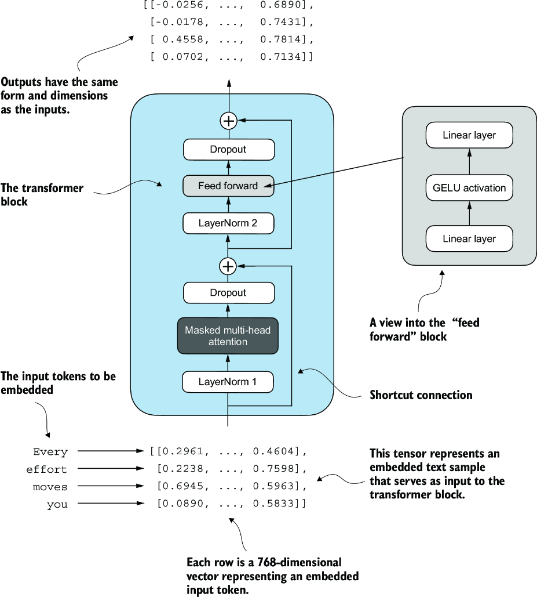

CHATPER 4 Implementing a GPT model from scratch to generate text
================================================================

Can you believe we are still at stage 1.🥲

.. image:: c4/1.png

The three main stages of coding an LLM. This chapter focuses on step 3 of stage 1: implementing the LLM architecture.

4.1 Coding an LLM architecture
------------------------------

LLMs, such as GPT (which stands for generative pretrained transformer). 基于他可以根据之前的text生成下一个单词或者token的能力，你可能会发现，实际上，他的结构并没有那么复杂。

We are scaling up to the size of a small GPT-2 model, specifically the smallest version with 124 million parameters, As described in `Language Models Are Unsupervised Multitask Learners <https://mng.bz/yoBq>`_ by Radford et al.

---

GPT-2 vs. GPT-3
   我们使用GPT-2 as it is usable。it would take 355 years to train GPT-3 on a single V100 datacenter GPU and 665 years on a consumer RTX 8000 GPU。

.. admonition:: gpt-2 Configuration

   .. code-block:: python

      GPT_CONFIG_124M = {
          "vocab_size": 50257,     # Vocabulary size
          "context_length": 1024,  # Context length
          "emb_dim": 768,          # Embedding dimension
          "n_heads": 12,           # Number of attention heads
          "n_layers": 12,          # Number of layers
          "drop_rate": 0.1,        # Dropout rate
          "qkv_bias": False        # Query-Key-Value bias
      }

- vocab_size refers to a vocabulary of 50,257 words, as used by the BPE tokenizer (see chapter 2).

- context_length denotes the maximum number of input tokens the model can handle via the positional embeddings (see chapter 2).

- emb_dim represents the embedding size, transforming each token into a 768-dimensional vector.

- n_heads indicates the count of attention heads in the multi-head attention mechanism (see chapter 3).

- n_layers specifies the number of transformer blocks in the model, which we will cover in the upcoming discussion.

- drop_rate indicates the intensity of the dropout mechanism (0.1 implies a 10% random drop out of hidden units) to prevent overfitting (see chapter 3).

- qkv_bias determines whether to include a bias vector in the Linear layers of the multi-head attention for query, key, and value computations. We will initially disable this, following the norms of modern LLMs, but we will revisit it in chapter 6 when we load pretrained GPT-2 weights from OpenAI into our model (see chapter 6).

下图展示了我们准备设计的GPT placeholder architecture：

.. image:: c4/3.png

*placeholder GPT model architecture class*

   .. code-block:: python

      import torch
      import torch.nn as nn

      class DummyGPTModel(nn.Module):
          def __init__(self, cfg):
              super().__init__()
              self.tok_emb = nn.Embedding(cfg["vocab_size"], cfg["emb_dim"])
              self.pos_emb = nn.Embedding(cfg["context_length"], cfg["emb_dim"])
              self.drop_emb = nn.Dropout(cfg["drop_rate"])
              self.trf_blocks = nn.Sequential(               #1
                  *[DummyTransformerBlock(cfg)               #1
                    for _ in range(cfg["n_layers"])]         #1
              )                                              #1
              self.final_norm = DummyLayerNorm(cfg["emb_dim"])     #2
              self.out_head = nn.Linear(
                  cfg["emb_dim"], cfg["vocab_size"], bias=False
              )

          def forward(self, in_idx):
              batch_size, seq_len = in_idx.shape
              tok_embeds = self.tok_emb(in_idx)
              pos_embeds = self.pos_emb(
                  torch.arange(seq_len, device=in_idx.device)
              )
              x = tok_embeds + pos_embeds
              x = self.drop_emb(x)
              x = self.trf_blocks(x)
              x = self.final_norm(x)
              logits = self.out_head(x)
              return logits

      class DummyTransformerBlock(nn.Module):    #3
          def __init__(self, cfg):
              super().__init__()

          def forward(self, x):     #4
              return x

      class DummyLayerNorm(nn.Module):           #5
          def __init__(self, normalized_shape, eps=1e-5):    #6
              super().__init__()

          def forward(self, x):
              return x

      #1 Uses a placeholder for TransformerBlock
      #2 Uses a placeholder for LayerNorm
      #3 A simple placeholder class that will be replaced by a real TransformerBlock later
      #4 This block does nothing and just returns its input.
      #5 A simple placeholder class that will be replaced by a real LayerNorm later
      #6 The parameters here are just to mimic the LayerNorm interface.

.. tip::

   Recall embedding: `Relative Positional Embeddings <https://readdoc333.readthedocs.io/en/latest/books/AI/build_large_model/chapter2.html#relative-positional-embeddings>`_

.. image:: c4/4.png
A big-picture overview showing how the input data is tokenized, embedded, and fed to the GPT model. The input text is first tokenized into integer token IDs. These IDs are passed through token and positional embedding layers to convert them into continuous vector representations. The combined embeddings are processed through transformer blocks, leading to contextualized outputs used for prediction.

In LLMs, the embedded input token dimension typically matches the output dimension. The output embeddings here represent the context vectors (see chapter 3).

.. code-block:: python

   import tiktoken

   tokenizer = tiktoken.get_encoding("gpt2")
   batch = []
   txt1 = "Every effort moves you"
   txt2 = "Every day holds a"

   batch.append(torch.tensor(tokenizer.encode(txt1)))
   batch.append(torch.tensor(tokenizer.encode(txt2)))
   batch = torch.stack(batch, dim=0)
   print(batch)
   # tensor([[6109, 3626, 6100,  345],
   #     [6109, 1110, 6622,  257]])

**what you got are TokenIds。**

----

124-million-parameter DummyGPTModel instance and feed it the tokenized batch:
   .. code-block:: python

      torch.manual_seed(123)
      model = DummyGPTModel(GPT_CONFIG_124M)
      logits = model(batch)
      print("Output shape:", logits.shape)
      print(logits)
      '''
      Output shape: torch.Size([2, 4, 50257])
      tensor([[[-1.2034,  0.3201, -0.7130,  ..., -1.5548, -0.2390, -0.4667],
               [-0.1192,  0.4539, -0.4432,  ...,  0.2392,  1.3469,  1.2430],
               [ 0.5307,  1.6720, -0.4695,  ...,  1.1966,  0.0111,  0.5835],
               [ 0.0139,  1.6755, -0.3388,  ...,  1.1586, -0.0435, -1.0400]],

              [[-1.0908,  0.1798, -0.9484,  ..., -1.6047,  0.2439, -0.4530],
               [-0.7860,  0.5581, -0.0610,  ...,  0.4835, -0.0077,  1.6621],
               [ 0.3567,  1.2698, -0.6398,  ..., -0.0162, -0.1296,  0.3717],
               [-0.2407, -0.7349, -0.5102,  ...,  2.0057, -0.3694,  0.1814]]],
             grad_fn=<UnsafeViewBackward0>)
      '''

The embedding has 50,257 dimensions because each of these dimensions refers to a unique token in the vocabulary. we will convert these 50,257-dimensional vectors back into token IDs, which we can then decode into words.

**The Token embeddings have done inside of the GPT model.**

----

4.2 Normalizing activations with layer normalization
----------------------------------------------------

.. important::

   Problems may face: vanishing or exploding gradients.

   The main idea behind layer normalization is to adjust the activations (outputs) of a neural network layer to have a mean of 0 and a variance of 1, also known as unit variance. This adjustment speeds up the convergence to effective weights and ensures consistent, reliable training.

   .. image:: c4/5.png

How to apply Normalization layer:
~~~~~~~~~~~~~~~~~~~~~~~~~~~~~~~~~

a neural network layer with five inputs and six outputs that we apply to two input examples:

- **1. Mean & Variance**

   .. code-block:: python

      torch.manual_seed(123)
      batch_example = torch.randn(2, 5)     #1
      layer = nn.Sequential(nn.Linear(5, 6), nn.ReLU())
      out = layer(batch_example)
      print(out)
      '''
      tensor([[0.2260, 0.3470, 0.0000, 0.2216, 0.0000, 0.0000],
        [0.2133, 0.2394, 0.0000, 0.5198, 0.3297, 0.0000]],
       grad_fn=<ReluBackward0>)
      '''

      mean = out.mean(dim=-1, keepdim=True)
      var = out.var(dim=-1, keepdim=True)
      print("Mean:\n", mean)
      print("Variance:\n", var)

      '''
      Mean:
        tensor([[0.1324],
                [0.2170]], grad_fn=<MeanBackward1>)
      Variance:
        tensor([[0.0231],
                [0.0398]], grad_fn=<VarBackward0>)
      '''

.. tip::

   Using keepdim=True in operations like mean or variance calculation ensures that the output tensor retains the same number of dimensions as the input tensor, even though the operation reduces the tensor along the dimension specified via dim. For instance, without keepdim=True, the returned mean tensor would be a two-dimensional vector [0.1324, 0.2170] instead of a 2 × 1–dimensional matrix [[0.1324], [0.2170]].

----

很有帮助理解-1 和 0 dim：

.. image:: c4/6.png

An illustration of the dim parameter when calculating the mean of a tensor. For instance, if we have a two-dimensional tensor (matrix) with dimensions [rows, columns], using dim=0 will perform the operation across rows (vertically, as shown at the bottom), resulting in an output that aggregates the data for each column. Using dim=1 or dim=-1 will perform the operation across columns (horizontally, as shown at the top), resulting in an output aggregating the data for each row.

----

- **2. Standard Deviation**

   .. code-block:: python

      out_norm = (out - mean) / torch.sqrt(var)
      mean = out_norm.mean(dim=-1, keepdim=True)
      var = out_norm.var(dim=-1, keepdim=True)
      print("Normalized layer outputs:\n", out_norm)
      print("Mean:\n", mean)
      print("Variance:\n", var)
      '''
      Normalized layer outputs:
       tensor([[ 0.6159,  1.4126, -0.8719,  0.5872, -0.8719, -0.8719],
              [-0.0189,  0.1121, -1.0876,  1.5173,  0.5647, -1.0876]],
             grad_fn=<DivBackward0>)
      Mean:
       tensor([[-5.9605e-08],
              [1.9868e-08]], grad_fn=<MeanBackward1>)
      Variance:
       tensor([[1.],
              [1.]], grad_fn=<VarBackward0>)
      '''

- **Combination of 1 & 2, A layer normalization class**

   .. code-block:: python

      class LayerNorm(nn.Module):
          def __init__(self, emb_dim):
              super().__init__()
              self.eps = 1e-5
              self.scale = nn.Parameter(torch.ones(emb_dim))
              self.shift = nn.Parameter(torch.zeros(emb_dim))

          def forward(self, x):
              mean = x.mean(dim=-1, keepdim=True)
              var = x.var(dim=-1, keepdim=True, unbiased=False)
              norm_x = (x - mean) / torch.sqrt(var + self.eps)
              return self.scale * norm_x + self.shift

.. tip::

   The variable eps is a small constant (epsilon) added to the variance to prevent division by zero during normalization. The scale and shift are two trainable parameters (of the same dimension as the input) that the LLM automatically adjusts during training if it is determined that doing so would improve the model’s performance on its training task. This allows the model to learn appropriate scaling and shifting that best suit the data it is processing.

- **Apply LayerNorm**

   .. code-block:: python

      ln = LayerNorm(emb_dim=5)
      out_ln = ln(batch_example)
      mean = out_ln.mean(dim=-1, keepdim=True)
      var = out_ln.var(dim=-1, unbiased=False, keepdim=True)
      print("Mean:\n", mean)
      print("Variance:\n", var)
      '''
      Mean:
       tensor([[    -0.0000],
              [     0.0000]], grad_fn=<MeanBackward1>)
      Variance:
       tensor([[1.0000],
              [1.0000]], grad_fn=<VarBackward0>)
      '''

.. admonition:: Layer normalization vs. batch normalization

   If you are familiar with batch normalization, a common and traditional normalization method for neural networks, you may wonder how it compares to layer normalization. Unlike batch normalization, which normalizes across the batch dimension, layer normalization normalizes across the feature dimension. LLMs often require significant computational resources, and the available hardware or the specific use case can dictate the batch size during training or inference. Since layer normalization normalizes each input independently of the batch size, it offers more flexibility and stability in these scenarios. This is particularly beneficial for distributed training or when deploying models in environments where resources are constrained.

   A paper about layer norm can be found at : < https://arxiv.org/abs/1607.06450?context=stat.ML>

.. image:: c4/7.png

.. admonition:: Extra Information about how layer narmalization works:

   - Step 1: Understand the Input

      Suppose you're working with a neural network layer, and the input is a feature vector for a single sample.

      Let:

      - :math:`x \in \mathbb{R}^d` be the input vector (e.g., :math:`x = [x_1, x_2, \dots, x_d]`)

      This input could come from:

         - A feedforward layer

         - An attention head

         - A recurrent layer, etc.

   - Step 2: Compute Mean and Variance (per sample)

      Layer normalization computes the **mean** and **variance** over the **feature dimension** for each individual sample.

      .. math::

         \mu = \frac{1}{d} \sum_{i=1}^{d} x_i

      .. math::

         \sigma^2 = \frac{1}{d} \sum_{i=1}^{d} (x_i - \mu)^2

      Where:

         - :math:`\mu` is the mean of the input features

         - :math:`\sigma^2` is the variance

   - Step 3: Normalize the Input

      Each feature is normalized to have zero mean and unit variance:

      .. math::

         \hat{x}_i = \frac{x_i - \mu}{\sqrt{\sigma^2 + \epsilon}}

      Where:

         - :math:`\epsilon` is a small constant to avoid division by zero

         - :math:`\hat{x}_i` is the normalized feature value

4.3 Implementing a feed forward network with GELU activations
--------------------------------------------------------------

.. attention::

   Historically, the ReLU activation function has been commonly used in deep learning due to its simplicity and effectiveness across various neural network architectures. However, in LLMs, several other activation functions are employed beyond the traditional ReLU. Two notable examples are GELU (Gaussian error linear unit) and SwiGLU (Swish-gated linear unit).

   the exact version is defined as GELU(x) = x⋅𝛷(x), where 𝛷(x) is the cumulative distribution function of the standard Gaussian distribution.

   it’s common to implement a computationally cheaper approximation (the original GPT-2 model was also trained with this approximation, which was found via curve fitting):

   .. math::

      \mathrm{GELU}(x) \approx 0.5 \cdot x \cdot \left(1 + \tanh \left[ \sqrt{\frac{2}{\pi}} \cdot \left(x + 0.044715 \cdot x^3 \right) \right] \right)

**An implementation of the GELU activation function**

   .. code-block:: python

      class GELU(nn.Module):
          def __init__(self):
              super().__init__()

          def forward(self, x):
              return 0.5 * x * (1 + torch.tanh(
                  torch.sqrt(torch.tensor(2.0 / torch.pi)) *
                  (x + 0.044715 * torch.pow(x, 3))
              ))

**GELU VS ReLU**

   .. code-block:: python

      import matplotlib.pyplot as plt
      gelu, relu = GELU(), nn.ReLU()

      x = torch.linspace(-3, 3, 100)     #1
      y_gelu, y_relu = gelu(x), relu(x)
      plt.figure(figsize=(8, 3))
      for i, (y, label) in enumerate(zip([y_gelu, y_relu], ["GELU", "ReLU"]), 1):
          plt.subplot(1, 2, i)
          plt.plot(x, y)
          plt.title(f"{label} activation function")
          plt.xlabel("x")
          plt.ylabel(f"{label}(x)")
          plt.grid(True)
      plt.tight_layout()
      plt.show()

   .. image:: c4/8.png

.. attention::

   GELU allows for a small, non-zero output for negative values. This characteristic means that during the training process, neurons that receive negative input can still contribute to the learning process, albeit to a lesser extent than positive inputs.

**A feed forward neural network module**

   .. code-block:: python

      class FeedForward(nn.Module):
          def __init__(self, cfg):
              super().__init__()
              self.layers = nn.Sequential(
                  nn.Linear(cfg["emb_dim"], 4 * cfg["emb_dim"]),
                  GELU(),
                  nn.Linear(4 * cfg["emb_dim"], cfg["emb_dim"]),
              )

          def forward(self, x):
              return self.layers(x)

   .. image:: c4/9.png

Testing: Initialize a new FeedForward module with a token embedding size of 768 and feed it a batch input with two samples and three tokens each:

   .. code-block:: python

      ffn = FeedForward(GPT_CONFIG_124M)
      x = torch.rand(2, 3, 768)          #1
      out = ffn(x)
      print(out.shape)
      #torch.Size([2, 3, 768])

Input.shape == Output.shape

.. admonition:: FeedForward

   Although the dim is not changed between input and output, but the first linear layer, expend the embedding dimension into a higher-dimensional space.  This expansion is followed by a nonlinear GELU activation and then a contraction back to the original dimension with the second linear transformation. Such a design allows for the exploration of a richer representation space.

   .. image:: c4/10.png

4.4 Adding shortcut connections
--------------------------------

.. image:: c4/11.png

.. admonition:: Shortcut Connections

   这里就是我们所说的：遗忘。 有关“遗忘机制”更详细的解释，请参见 :ref:`statquest-josh-starmer`。

   AKA `skip` or `residual connections`, it mitigates the challenge of vanishing gradients. Sometime it has ability to avoid or skip one or more layers. which is achieved by adding the output of one layer to the output of a later layer.
   **Backpropagation**

.. image:: c4/12.png

**A neural network to illustrate shortcut connections**

   .. code-block:: python

      class ExampleDeepNeuralNetwork(nn.Module):
          def __init__(self, layer_sizes, use_shortcut):
              super().__init__()
              self.use_shortcut = use_shortcut
              self.layers = nn.ModuleList([       #1
                  nn.Sequential(nn.Linear(layer_sizes[0], layer_sizes[1]),
                                GELU()),
                  nn.Sequential(nn.Linear(layer_sizes[1], layer_sizes[2]),
                                GELU()),
                  nn.Sequential(nn.Linear(layer_sizes[2], layer_sizes[3]),
                                GELU()),
                  nn.Sequential(nn.Linear(layer_sizes[3], layer_sizes[4]),
                                GELU()),
                  nn.Sequential(nn.Linear(layer_sizes[4], layer_sizes[5]),
                                GELU())
              ])

          def forward(self, x):
              for layer in self.layers:
                  layer_output = layer(x)         #2
                  if self.use_shortcut and x.shape == layer_output.shape:    #3
                      x = x + layer_output
                  else:
                      x = layer_output
              return x
      #1 Implements five layers
      #2 Compute the output of the current layer
      #3 Check if shortcut can be applied

下面我们假设，layer_sizes都是一样的为 3， 但是我们设定最后的layer输出是 size=1.

   .. code-block:: python

      layer_sizes = [3, 3, 3, 3, 3, 1]
      sample_input = torch.tensor([[1., 0., -1.]])
      torch.manual_seed(123)                            #1
      model_without_shortcut = ExampleDeepNeuralNetwork(
          layer_sizes, use_shortcut=False
      )
之后，我们设计一个可以进行 backpropagation function。

   .. code-block:: python

      def print_gradients(model, x):
          output = model(x)             #1
          target = torch.tensor([[0.]])

          loss = nn.MSELoss()
          loss = loss(output, target)    #2

          loss.backward()          #3

          for name, param in model.named_parameters():
              if 'weight' in name:
                  print(f"{name} has gradient mean of {param.grad.abs().mean().item()}")

   .. tip::

      A loss function that computes how close the model output and a user-specified target (here, for simplicity, the value 0) are.
      简单的理解，loss function 就是一个可以用来评估模型输出和我们期待的结果差距有多大。这个function的主要作用是让backpropagation有据可依的修改weights。

      See :ref:`daniel-bourke-pytorch-course` for a great beginner-friendly PyTorch course.

   .. code-block:: python

      print_gradients(model_without_shortcut, sample_input)
      '''
      layers.0.0.weight has gradient mean of 0.00020173587836325169
      layers.1.0.weight has gradient mean of 0.0001201116101583466
      layers.2.0.weight has gradient mean of 0.0007152041653171182
      layers.3.0.weight has gradient mean of 0.001398873864673078
      layers.4.0.weight has gradient mean of 0.005049646366387606
      '''

   .. tip::

      the vanishing gradient problem.
      随着我们的backpropagation的进度，从layer4 到 layer0， gradient 逐渐消失了。

Use skip connection:

   .. code-block:: python

      torch.manual_seed(123)
      model_with_shortcut = ExampleDeepNeuralNetwork(
          layer_sizes, use_shortcut=True
      )
      print_gradients(model_with_shortcut, sample_input)

      '''
      layers.0.0.weight has gradient mean of 0.22169792652130127
      layers.1.0.weight has gradient mean of 0.20694105327129364
      layers.2.0.weight has gradient mean of 0.32896995544433594
      layers.3.0.weight has gradient mean of 0.2665732502937317
      layers.4.0.weight has gradient mean of 1.3258541822433472
      '''

Shortcut connections are important for overcoming the limitations posed by vanishing gradient problem. It is a core building block of very large model such as LLMs.

4.5 Connecting attention and linear layers in a transformer block
-----------------------------------------------------------------

Transformer block, a fundamental building block of GPT and other LLM architectures.

.. admonition:: Something we need to understand.

   - Something may explain how or why uses Self-Attention Mechanism.

      “The animal didn’t cross the street because it was too tired,”, with self-attention especially multi-head attention, the model will know "it" is "animal".

   - Feed-Forward Network (FFN).

      Think of this as "refining" each word's representation after the relational context is captured.

   Self-attention gives context-awareness: It learns how each word relates to the others.

   Feed-forward gives position-wise transformation: It lets the model change the representation of each token after understanding context.

   Together, this allows transformers to capture both inter-word dependencies and per-token transformation, which is powerful for complex patterns in natural language.

**The transformer block component of GPT**

   .. code-block:: python

      from chapter03 import MultiHeadAttention

      class TransformerBlock(nn.Module):
          def __init__(self, cfg):
              super().__init__()
              self.att = MultiHeadAttention(
                  d_in=cfg["emb_dim"],
                  d_out=cfg["emb_dim"],
                  context_length=cfg["context_length"],
                  num_heads=cfg["n_heads"],
                  dropout=cfg["drop_rate"],
                  qkv_bias=cfg["qkv_bias"])
              self.ff = FeedForward(cfg)
              self.norm1 = LayerNorm(cfg["emb_dim"])
              self.norm2 = LayerNorm(cfg["emb_dim"])
              self.drop_shortcut = nn.Dropout(cfg["drop_rate"])

          def forward(self, x):
       #1
              shortcut = x
              x = self.norm1(x)
              x = self.att(x)
              x = self.drop_shortcut(x)
              x = x + shortcut      #2

              shortcut = x         #3
              x = self.norm2(x)
              x = self.ff(x)
              x = self.drop_shortcut(x)
              x = x + shortcut      #4
              return x
         #1 Shortcut connection for attention block
         #2 Add the original input back
         #3 Shortcut connection for feed forward block
         #4 Adds the original input back

   .. tip::

      .. code-block:: python

         class FeedForward(nn.Module):
             def __init__(self, cfg):
                 super().__init__()
                 self.layers = nn.Sequential(
                     nn.Linear(cfg["emb_dim"], 4 * cfg["emb_dim"]),
                     GELU(),
                     nn.Linear(4 * cfg["emb_dim"], cfg["emb_dim"]),
                 )

             def forward(self, x):
                 return self.layers(x)

Using the GPT_CONFIG_124M dictionary we defined earlier, let’s instantiate a transformer block and feed it some sample data:

   .. code-block:: python

      torch.manual_seed(123)
      x = torch.rand(2, 4, 768)                   #1 Creates sample input of shape [batch_size, num_tokens, emb_dim]
      block = TransformerBlock(GPT_CONFIG_124M)
      output = block(x)

      print("Input shape:", x.shape)
      print("Output shape:", output.shape)
      #Input shape: torch.Size([2, 4, 768])
      #Output shape: torch.Size([2, 4, 768])

----

.. _statquest-josh-starmer:

推荐资源：StatQuest 频道
==========================

在 `StatQuest with Josh Starmer <https://www.youtube.com/@statquest/>`_ 的 YouTube 频道上，有关于 **机器学习（ML）** 的详细介绍。
其中提到了如何解决早期的 token 会随着“时间”的流逝变得不那么重要，或者说关联性逐渐消失的问题。

该频道用清晰直观的方式讲解复杂的统计和机器学习概念，非常适合打好基础或查漏补缺。

.. _daniel-bourke-pytorch-course:

Recommended PyTorch Course
==============

I highly recommend the YouTube channel of **Daniel Bourke**.
He offers a fantastic, full-length course on **PyTorch**, explaining key concepts like the **loss function** and **backpropagation** in exceptional detail.

You can watch the course here:

`Daniel Bourke – PyTorch Full Course on YouTube <https://www.youtube.com/watch?v=Z_ikDlimN6A>`_

