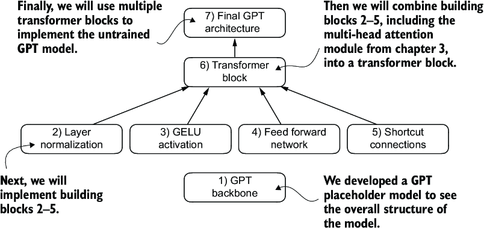

CHATPER 4 Implementing a GPT model from scratch to generate text
================================================================

Can you believe we are still at stage 1.🥲

.. image:: c4/1.png

The three main stages of coding an LLM. This chapter focuses on step 3 of stage 1: implementing the LLM architecture.

4.1 Coding an LLM architecture
------------------------------

LLMs, such as GPT (which stands for generative pretrained transformer). 基于他可以根据之前的text生成下一个单词或者token的能力，你可能会发现，实际上，他的结构并没有那么复杂。

.. image:: c4/2.png

We are scaling up to the size of a small GPT-2 model, specifically the smallest version with 124 million parameters, As described in `Language Models Are Unsupervised Multitask Learners <https://mng.bz/yoBq>`_ by Radford et al.

---

GPT-2 vs. GPT-3
   我们使用GPT-2 as it is usable。it would take 355 years to train GPT-3 on a single V100 datacenter GPU and 665 years on a consumer RTX 8000 GPU。

.. admonition:: gpt-2 Configuration

   .. code-block:: python

      GPT_CONFIG_124M = {
          "vocab_size": 50257,     # Vocabulary size
          "context_length": 1024,  # Context length
          "emb_dim": 768,          # Embedding dimension
          "n_heads": 12,           # Number of attention heads
          "n_layers": 12,          # Number of layers
          "drop_rate": 0.1,        # Dropout rate
          "qkv_bias": False        # Query-Key-Value bias
      }

- vocab_size refers to a vocabulary of 50,257 words, as used by the BPE tokenizer (see chapter 2).

- context_length denotes the maximum number of input tokens the model can handle via the positional embeddings (see chapter 2).

- emb_dim represents the embedding size, transforming each token into a 768-dimensional vector.

- n_heads indicates the count of attention heads in the multi-head attention mechanism (see chapter 3).

- n_layers specifies the number of transformer blocks in the model, which we will cover in the upcoming discussion.

- drop_rate indicates the intensity of the dropout mechanism (0.1 implies a 10% random drop out of hidden units) to prevent overfitting (see chapter 3).

- qkv_bias determines whether to include a bias vector in the Linear layers of the multi-head attention for query, key, and value computations. We will initially disable this, following the norms of modern LLMs, but we will revisit it in chapter 6 when we load pretrained GPT-2 weights from OpenAI into our model (see chapter 6).

下图展示了我们准备设计的GPT placeholder architecture：

*placeholder GPT model architecture class*

.. code-block:: python

   import torch
   import torch.nn as nn

   class DummyGPTModel(nn.Module):
       def __init__(self, cfg):
           super().__init__()
           self.tok_emb = nn.Embedding(cfg["vocab_size"], cfg["emb_dim"])
           self.pos_emb = nn.Embedding(cfg["context_length"], cfg["emb_dim"])
           self.drop_emb = nn.Dropout(cfg["drop_rate"])
           self.trf_blocks = nn.Sequential(               #1
               *[DummyTransformerBlock(cfg)               #1
                 for _ in range(cfg["n_layers"])]         #1
           )                                              #1
           self.final_norm = DummyLayerNorm(cfg["emb_dim"])     #2
           self.out_head = nn.Linear(
               cfg["emb_dim"], cfg["vocab_size"], bias=False
           )

       def forward(self, in_idx):
           batch_size, seq_len = in_idx.shape
           tok_embeds = self.tok_emb(in_idx)
           pos_embeds = self.pos_emb(
               torch.arange(seq_len, device=in_idx.device)
           )
           x = tok_embeds + pos_embeds
           x = self.drop_emb(x)
           x = self.trf_blocks(x)
           x = self.final_norm(x)
           logits = self.out_head(x)
           return logits

   class DummyTransformerBlock(nn.Module):    #3
       def __init__(self, cfg):
           super().__init__()

       def forward(self, x):     #4
           return x

   class DummyLayerNorm(nn.Module):           #5
       def __init__(self, normalized_shape, eps=1e-5):    #6
           super().__init__()

       def forward(self, x):
           return x

   #1 Uses a placeholder for TransformerBlock
   #2 Uses a placeholder for LayerNorm
   #3 A simple placeholder class that will be replaced by a real TransformerBlock later
   #4 This block does nothing and just returns its input.
   #5 A simple placeholder class that will be replaced by a real LayerNorm later
   #6 The parameters here are just to mimic the LayerNorm interface.

