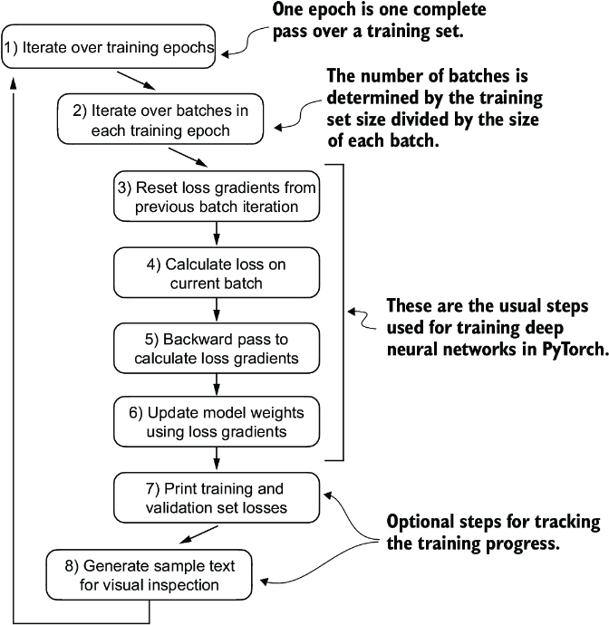
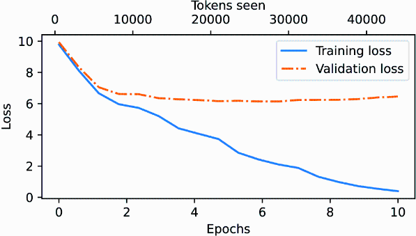
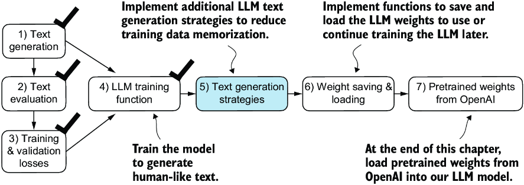

CHATPER 5 Pretraining on unlabeled data
=======================================

Over view the progress so far:

.. image:: c5/5-1.png

This chapter focuses on the pretraining the LLM.

5.1 Evaluating generative text models
-------------------------------------

An overview of the topics coverd in this chapter.

.. image:: c5/5-2.png

5.1.1 Using GPT to generate text
~~~~~~~~~~~~~~~~~~~~~~~~~~~~~~~~

.. code-block:: python

   import torch
   from chapter04 import GPTModel

   GPT_CONFIG_124M = {
       "vocab_size": 50257,
       "context_length": 256,
       "emb_dim": 768,
       "n_heads": 12,
       "n_layers": 12,
       "drop_rate": 0.1,
       "qkv_bias": False
   }
   torch.manual_seed(123)
   model = GPTModel(GPT_CONFIG_124M)
   model.eval()

.. image:: c5/5-3.png

.. code-block:: python

   import tiktoken
   from chapter04 import generate_text_simple

   def text_to_token_ids(text, tokenizer):
       encoded = tokenizer.encode(text, allowed_special={'<|endoftext|>'})
       encoded_tensor = torch.tensor(encoded).unsqueeze(0)
       return encoded_tensor

   def token_ids_to_text(token_ids, tokenizer):
       flat = token_ids.squeeze(0)
       return tokenizer.decode(flat.tolist())

   start_context = "Every effort moves you"
   tokenizer = tiktoken.get_encoding("gpt2")

   token_ids = generate_text_simple(
       model=model,
       idx=text_to_token_ids(start_context, tokenizer),
       max_new_tokens=10,
       context_size=GPT_CONFIG_124M["context_length"]
   )
   print("Output text:\n", token_ids_to_text(token_ids, tokenizer))

Nothing new here. Simple functions of encode and decode.

.. note::
   Output text:
   Every effort moves you rentingetic wasnم refres RexMeCHicular

Since the model has not been trained yet. The result looks mess is totally normal.

5.1.2 Calculating the text generation loss
~~~~~~~~~~~~~~~~~~~~~~~~~~~~~~~~~~~~~~~~~~

How to measure the quality of model's output?

We can use: **Cross-entropy and perplexity**

Five-step procedure:

.. image:: c5/5-4.png

**Step 1: Generate text**

.. code-block:: python

   inputs = torch.tensor([[16833, 3626, 6100],   # ["every effort moves",
                       [40,    1107, 588]])   #  "I really like"]

   targets = torch.tensor([[3626, 6100, 345  ],  # [" effort moves you",
                        [1107, 588, 11311]])  #  " really like choc

   with torch.no_grad():     #1
      logits = model(inputs)
   probas = torch.softmax(logits, dim=-1)     #2
   print(probas.shape)

   # torch.Size([2, 3, 50257])

   token_ids = torch.argmax(probas, dim=-1, keepdim=True)
   print("Token IDs:\n", token_ids)

   '''
   Token IDs:
    tensor([[[16657],       #1
            [  339],
            [42826]],
           [[49906],        #2
            [29669],
            [41751]]])
   '''

   print(f"Targets batch 1: {token_ids_to_text(targets[0], tokenizer)}")
   print(f"Outputs batch 1:"
         f" {token_ids_to_text(token_ids[0].flatten(), tokenizer)}")

   '''
   Targets batch 1:  effort moves you
   Outputs batch 1:  Armed heNetflix
   '''

**Step 2: Implement the text evaluation function.**

.. image:: c5/5-5.png

measure “how far” the generated tokens are from the correct predictions (targets). The training function we implement later will use this information to adjust the model weights to generate text that is more similar to (or, ideally, matches) the target text.

.. image:: c5/5-6.png

Before training, the model produces random next-token probability vectors. The goal of model training is to ensure that the probability values corresponding to the highlighted target token IDs are maximized.

For each of the two input texts, we can print the initial softmax probability scores corresponding to the target tokens using the following code:

.. code-block:: python

   text_idx = 0
   target_probas_1 = probas[text_idx, [0, 1, 2], targets[text_idx]]
   print("Text 1:", target_probas_1)

   text_idx = 1
   target_probas_2 = probas[text_idx, [0, 1, 2], targets[text_idx]]
   print("Text 2:", target_probas_2)

   '''
   Text 1: tensor([7.4541e-05, 3.1061e-05, 1.1563e-05])
   Text 2: tensor([1.0337e-05, 5.6776e-05, 4.7559e-06])
   '''

How do we maximize the softmax probability values corresponding to the target tokens?

**BACKPROPAGATION**

.. note::
   Backpropagation requires a loss function, which calculates the difference between the model’s predicted output (here, the probabilities corresponding to the target token IDs) and the actual desired output. This loss function measures how far off the model’s predictions are from the target values.

These processes are following :

.. code-block:: python

   # We done step 1-3 so far
   #4
   log_probas = torch.log(torch.cat((target_probas_1, target_probas_2)))
   print(log_probas)

   #5
   avg_log_probas = torch.mean(log_probas)
   print(avg_log_probas)
   # tensor(-10.7940)

   #6
   neg_avg_log_probas = avg_log_probas * -1
   print(neg_avg_log_probas)
   # tensor(10.7940)

In deep learning, the term for turning this negative value, –10.7940, into 10.7940, is known as the cross entropy loss

The logarithm to the probability scores:

.. image:: c5/5-7.png

**CROSS ENTROPY LOSS [What we normally use, it is easy way.]**

.. note::

   Logits shape: torch.Size([2, 3, 50257])
   Targets shape: torch.Size([2, 3])

   To apply the cross_entropy loos function in PyTorch, we want to flatten these tensors by combining them over the batch dimension.

.. code-block:: python

   logits_flat = logits.flatten(0, 1)
   targets_flat = targets.flatten()
   print("Flattened logits:", logits_flat.shape)
   print("Flattened targets:", targets_flat.shape)

   '''
   Flattened logits: torch.Size([6, 50257])
   Flattened targets: torch.Size([6])
   '''

   loss = torch.nn.functional.cross_entropy(logits_flat, targets_flat)
   print(loss)
   #tensor(10.7940)

Result is same as manually.

**PERPLEXITY**

Perplexity is a measure often used alongside cross entropy loss to evaluate the performance of models in tasks like language modeling.

.. note::

   Perplexity measures how well the probability distribution predicted by the model matches the actual distribution of the words in the dataset. Similar to the loss, a lower perplexity indicates that the model predictions are closer to the actual distribution.
    
   Perplexity can be calculated as perplexity = torch.exp(loss), which returns tensor(48725.8203) when applied to the previously calculated loss

5.1.3 Calculating the training and validation set losses
~~~~~~~~~~~~~~~~~~~~~~~~~~~~~~~~~~~~~~~~~~~~~~~~~~~~~~~~

.. image:: c5/5-8.png

Having completed steps 1 and 2, including computing the cross entropy loss, we can now apply this loss computation to the entire text dataset that we will use for model training.

.. image:: c5/5-9.png

When preparing the data loaders, we split the input text into training and validation set portions. Then we tokenize the text (only shown for the training set portion for simplicity) and divide the tokenized text into chunks of a user-specified length (here, 6). Finally, we shuffle the rows and organize the chunked text into batches (here, batch size 2), which we can use for model training.

.. code-block:: python

   import os
   import requests

   file_path = "the-verdict.txt"
   url = "https://raw.githubusercontent.com/rasbt/LLMs-from-scratch/main/ch02/01_main-chapter-code/the-verdict.txt"

   if not os.path.exists(file_path):
       response = requests.get(url, timeout=30)
       response.raise_for_status()
       text_data = response.text
       with open(file_path, "w", encoding="utf-8") as file:
           file.write(text_data)
   else:
       with open(file_path, "r", encoding="utf-8") as file:
           text_data = file.read()

   total_characters = len(text_data)
   total_tokens = len(tokenizer.encode(text_data))
   print("Characters:", total_characters)
   print("Tokens:", total_tokens)
   #Characters: 20479
   #Tokens: 5145

   train_ratio = 0.90
   split_idx = int(train_ratio * len(text_data))
   train_data = text_data[:split_idx]
   val_data = text_data[split_idx:]

   # DataLoader: training and validate
   def create_dataloader_v1(txt, batch_size=4, max_length=256,
                         stride=128, shuffle=True, drop_last=True, num_workers=0):
       # Initialize the tokenizer
       tokenizer = tiktoken.get_encoding("gpt2")

       # Create dataset
       dataset = GPTDatasetV1(txt, tokenizer, max_length, stride)

       # Create dataloader
       dataloader = DataLoader(
           dataset, batch_size=batch_size, shuffle=shuffle, drop_last=drop_last, num_workers=num_workers)

       return dataloader

   torch.manual_seed(123)

   train_loader = create_dataloader_v1(
       train_data,
       batch_size=2,
       max_length=GPT_CONFIG_124M["context_length"],
       stride=GPT_CONFIG_124M["context_length"],
       drop_last=True,
       shuffle=True,
       num_workers=0
   )
   val_loader = create_dataloader_v1(
       val_data,
       batch_size=2,
       max_length=GPT_CONFIG_124M["context_length"],
       stride=GPT_CONFIG_124M["context_length"],
       drop_last=False,
       shuffle=False,
       num_workers=0
   )
   '''
   Train loader:
   torch.Size([2, 256]) torch.Size([2, 256])
   torch.Size([2, 256]) torch.Size([2, 256])
   torch.Size([2, 256]) torch.Size([2, 256])
   torch.Size([2, 256]) torch.Size([2, 256])
   torch.Size([2, 256]) torch.Size([2, 256])
   torch.Size([2, 256]) torch.Size([2, 256])
   torch.Size([2, 256]) torch.Size([2, 256])
   torch.Size([2, 256]) torch.Size([2, 256])
   torch.Size([2, 256]) torch.Size([2, 256])

   Validation loader:
   torch.Size([2, 256]) torch.Size([2, 256])

   we have nine training set batches with two samples and 256 tokens each. Since we allocated only 10% of the data for validation, there is only one validation batch consisting of two input examples. As expected, the input data (x) and target data (y) have the same shape (the batch size times the number of tokens in each batch) since the targets are the inputs shifted by one position
   '''
   # Cross entropy loss
   def calc_loss_batch(input_batch, target_batch, model, device):
       input_batch = input_batch.to(device)         #1
       target_batch = target_batch.to(device)
       logits = model(input_batch)
       loss = torch.nn.functional.cross_entropy(
           logits.flatten(0, 1), target_batch.flatten()
       )
       return loss

   #Function to compute the training and validation loss
   def calc_loss_loader(data_loader, model, device, num_batches=None):

      #1 Iteratives over all batches if no fixed num_batches is specified
      #2 Reduces the number of batches to match the total number of batches in the data loader if num_batches exceeds the number of batches in the data loader
      #3 Sums loss for each batch
      #4 Averages the loss over all batches

      total_loss = 0.
       if len(data_loader) == 0:
           return float("nan")
       elif num_batches is None:
           num_batches = len(data_loader)     #1
       else:
           num_batches = min(num_batches, len(data_loader))   #2
       for i, (input_batch, target_batch) in enumerate(data_loader):
           if i < num_batches:
               loss = calc_loss_batch(
                   input_batch, target_batch, model, device
               )
               total_loss += loss.item()    #3
           else:
               break
       return total_loss / num_batches    #4

   device = torch.device("cuda" if torch.cuda.is_available() else "cpu")
   model.to(device)   #1
   with torch.no_grad():                                        #2
       train_loss = calc_loss_loader(train_loader, model, device)    #3
       val_loss = calc_loss_loader(val_loader, model, device)
   print("Training loss:", train_loss)
   print("Validation loss:", val_loss)

5.2 Training an LLM
-------------------

Interested readers can learn about more advanced techniques, including learning rate warmup, cosine annealing, and gradient clipping

.. admonition:: Train model

   .. code-block:: python

      def train_model_simple(model, train_loader, val_loader,
                          optimizer, device, num_epochs,
                          eval_freq, eval_iter, start_context, tokenizer):
          '''

            #1 Initializes lists to track losses and tokens seen
            #2 Starts the main training loop
            #3 Resets loss gradients from the previous batch iteration
            #4 Calculates loss gradients
            #5 Updates model weights using loss gradients
            #6 Optional evaluation step
            #7 Prints a sample text after each epoch

          '''
          train_losses, val_losses, track_tokens_seen = [], [], []    #1
          tokens_seen, global_step = 0, -1

          for epoch in range(num_epochs):    #2
              model.train()
              for input_batch, target_batch in train_loader:
                  optimizer.zero_grad()   #3
                  loss = calc_loss_batch(
                      input_batch, target_batch, model, device
                  )
                  loss.backward()                     #4
                  optimizer.step()                    #5
                  tokens_seen += input_batch.numel()
                  global_step += 1

                  if global_step % eval_freq == 0:    #6
                      train_loss, val_loss = evaluate_model(
                          model, train_loader, val_loader, device, eval_iter)
                      train_losses.append(train_loss)
                      val_losses.append(val_loss)
                      track_tokens_seen.append(tokens_seen)
                      print(f"Ep {epoch+1} (Step {global_step:06d}): "
                            f"Train loss {train_loss:.3f}, "
                            f"Val loss {val_loss:.3f}"
                      )

              generate_and_print_sample(                      #7
                  model, tokenizer, device, start_context
              )
          return train_losses, val_losses, track_tokens_seen

.. code-block:: python

   def evaluate_model(model, train_loader, val_loader, device, eval_iter):
       model.eval()  #1
       with torch.no_grad():                              #2
           train_loss = calc_loss_loader(
               train_loader, model, device, num_batches=eval_iter
           )
           val_loss = calc_loss_loader(
               val_loader, model, device, num_batches=eval_iter
           )
       model.train()
       return train_loss, val_loss

   def generate_and_print_sample(model, tokenizer, device, start_context):
       model.eval()
       context_size = model.pos_emb.weight.shape[0]
       encoded = text_to_token_ids(start_context, tokenizer).to(device)
       with torch.no_grad():
           token_ids = generate_text_simple(
               model=model, idx=encoded,
               max_new_tokens=50, context_size=context_size
           )
       decoded_text = token_ids_to_text(token_ids, tokenizer)
       print(decoded_text.replace("\n", " "))      #1
       model.train()

.. admonition:: Adam Optimizers

   In out training loop, we opt for the AdamW optimizer. It is a variant of Adam that improves the weight decay approach, which aims to minimize model complexity and prevent overfitting by penalizing larger weights.

   .. code-block:: python

      torch.manual_seed(123)
      model = GPTModel(GPT_CONFIG_124M)
      model.to(device)
      optimizer = torch.optim.AdamW(
           model.parameters(),           #1
          lr=0.0004, weight_decay=0.1
      )
      num_epochs = 10
      train_losses, val_losses, tokens_seen = train_model_simple(
          model, train_loader, val_loader, optimizer, device,
          num_epochs=num_epochs, eval_freq=5, eval_iter=5,
          start_context="Every effort moves you", tokenizer=tokenizer
      )

      '''
      Ep 1 (Step 000000): Train loss 9.781, Val loss 9.933
      Ep 1 (Step 000005): Train loss 8.111, Val loss 8.339
      Every effort moves you,,,,,,,,,,,,.
      Ep 2 (Step 000010): Train loss 6.661, Val loss 7.048
      Ep 2 (Step 000015): Train loss 5.961, Val loss 6.616
      Every effort moves you, and, and, and, and, and, and, and, and, and, and, and, and, and, and, and, and, and, and, and, and, and, and,, and, and,
      Ep 3 (Step 000020): Train loss 5.726, Val loss 6.600
      Ep 3 (Step 000025): Train loss 5.201, Val loss 6.348
      Every effort moves you, and I had been.
      Ep 4 (Step 000030): Train loss 4.417, Val loss 6.278
      Ep 4 (Step 000035): Train loss 4.069, Val loss 6.226
      Every effort moves you know the                          "I he had the donkey and I had the and I had the donkey and down the room, I had
      Ep 5 (Step 000040): Train loss 3.732, Val loss 6.160
      Every effort moves you know it was not that the picture--I had the fact by the last I had been--his, and in the            "Oh, and he said, and down the room, and in
      Ep 6 (Step 000045): Train loss 2.850, Val loss 6.179
      Ep 6 (Step 000050): Train loss 2.427, Val loss 6.141
      Every effort moves you know," was one of the picture. The--I had a little of a little: "Yes, and in fact, and in the picture was, and I had been at my elbow and as his pictures, and down the room, I had
      Ep 7 (Step 000055): Train loss 2.104, Val loss 6.134
      Ep 7 (Step 000060): Train loss 1.882, Val loss 6.233
      Every effort moves you know," was one of the picture for nothing--I told Mrs.  "I was no--as! The women had been, in the moment--as Jack himself, as once one had been the donkey, and were, and in his
      Ep 8 (Step 000065): Train loss 1.320, Val loss 6.238
      Ep 8 (Step 000070): Train loss 0.985, Val loss 6.242
      Every effort moves you know," was one of the axioms he had been the tips of a self-confident moustache, I felt to see a smile behind his close grayish beard--as if he had the donkey. "strongest," as his
      Ep 9 (Step 000075): Train loss 0.717, Val loss 6.293
      Ep 9 (Step 000080): Train loss 0.541, Val loss 6.393
      Every effort moves you?"  "Yes--quite insensible to the irony. She wanted him vindicated--and by me!"  He laughed again, and threw back the window-curtains, I had the donkey. "There were days when I
      Ep 10 (Step 000085): Train loss 0.391, Val loss 6.452
      Every effort moves you know," was one of the axioms he laid down across the Sevres and silver of an exquisitely appointed luncheon-table, when, on a later day, I had again run over from Monte Carlo; and Mrs. Gis
      '''

Show in Plot:

.. code-block:: python

   import matplotlib.pyplot as plt
   from matplotlib.ticker import MaxNLocator
   def plot_losses(epochs_seen, tokens_seen, train_losses, val_losses):
       fig, ax1 = plt.subplots(figsize=(5, 3))
       ax1.plot(epochs_seen, train_losses, label="Training loss")
       ax1.plot(
           epochs_seen, val_losses, linestyle="-.", label="Validation loss"
       )
       ax1.set_xlabel("Epochs")
       ax1.set_ylabel("Loss")
       ax1.legend(loc="upper right")
       ax1.xaxis.set_major_locator(MaxNLocator(integer=True))
       ax2 = ax1.twiny()                   #1
       ax2.plot(tokens_seen, train_losses, alpha=0)     #2
       ax2.set_xlabel("Tokens seen")
       fig.tight_layout()
       plt.show()

   epochs_tensor = torch.linspace(0, num_epochs, len(train_losses))
   plot_losses(epochs_tensor, tokens_seen, train_losses, val_losses)

After 2 epoches, the validation loss becomes stable. This is a sign that the model is still learning, but it’s overfitting to the training set past epoch 2.

5.3 Decoding strategies to control randomness
----------------------------------------------

