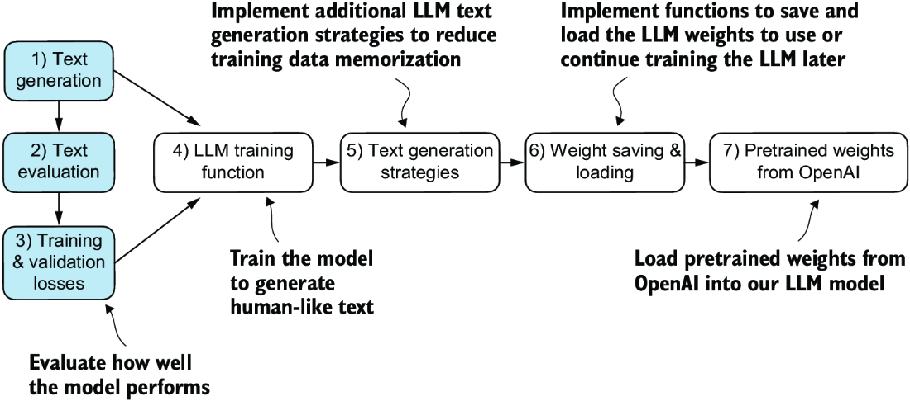
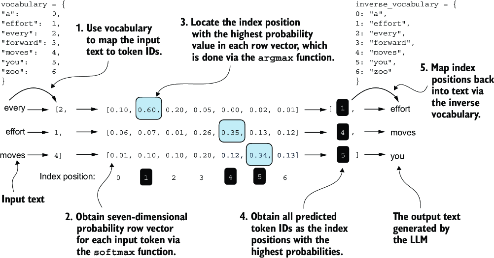
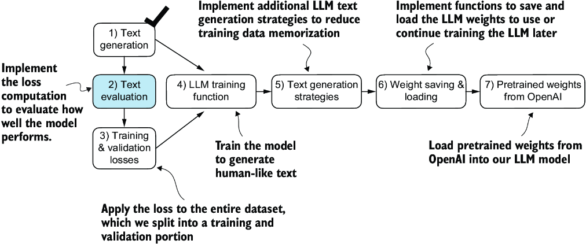
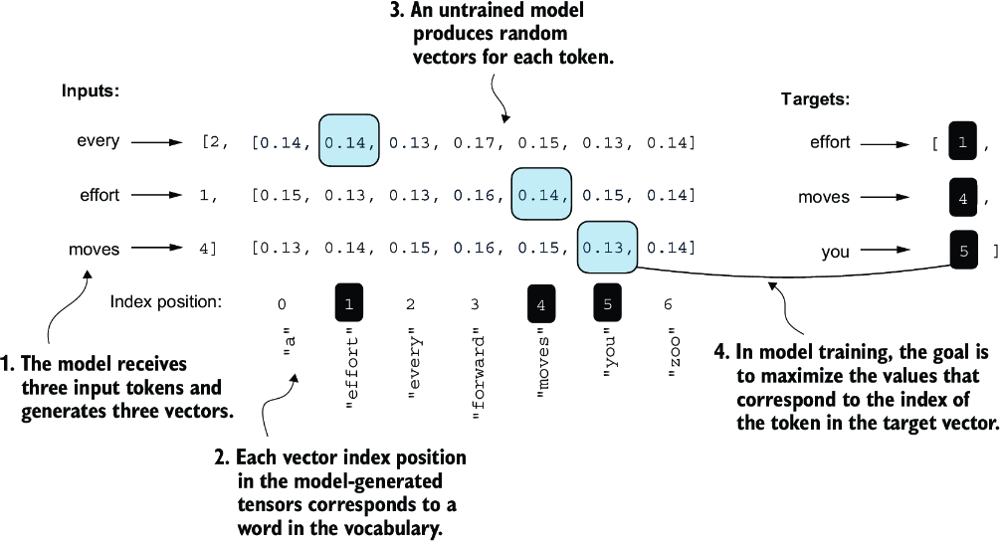
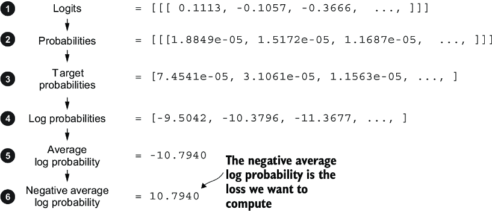
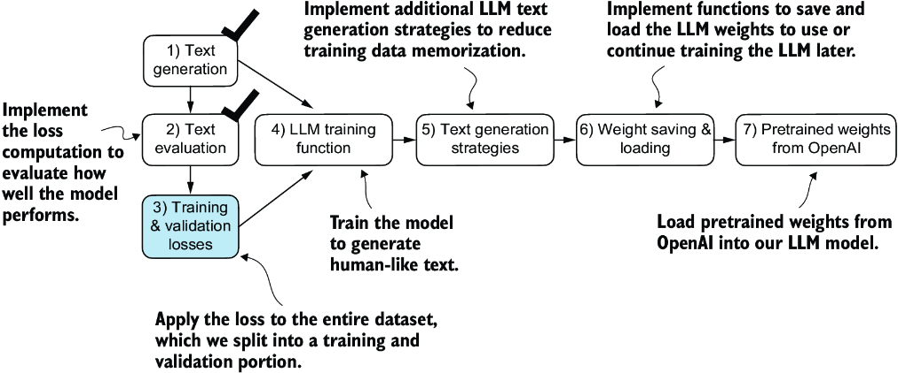
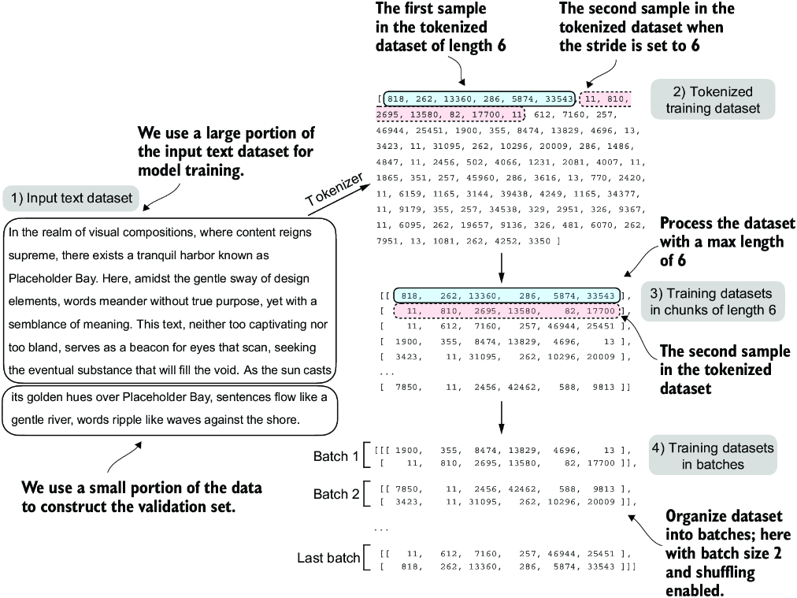

CHATPER 5 Pretraining on unlabeled data
=======================================

Over view the progress so far:

.. image:: c5/5-1.png

This chapter focuses on the pretraining the LLM.

5.1 Evaluating generative text models
-------------------------------------

An overview of the topics coverd in this chapter.

5.1.1 Using GPT to generate text
~~~~~~~~~~~~~~~~~~~~~~~~~~~~~~~~

.. code-block:: python

   import torch
   from chapter04 import GPTModel

   GPT_CONFIG_124M = {
       "vocab_size": 50257,
       "context_length": 256,
       "emb_dim": 768,
       "n_heads": 12,
       "n_layers": 12,
       "drop_rate": 0.1,
       "qkv_bias": False
   }
   torch.manual_seed(123)
   model = GPTModel(GPT_CONFIG_124M)
   model.eval()

.. image:: c5/5-3.png

.. code-block:: python

   import tiktoken
   from chapter04 import generate_text_simple

   def text_to_token_ids(text, tokenizer):
       encoded = tokenizer.encode(text, allowed_special={'<|endoftext|>'})
       encoded_tensor = torch.tensor(encoded).unsqueeze(0)
       return encoded_tensor

   def token_ids_to_text(token_ids, tokenizer):
       flat = token_ids.squeeze(0)
       return tokenizer.decode(flat.tolist())

   start_context = "Every effort moves you"
   tokenizer = tiktoken.get_encoding("gpt2")

   token_ids = generate_text_simple(
       model=model,
       idx=text_to_token_ids(start_context, tokenizer),
       max_new_tokens=10,
       context_size=GPT_CONFIG_124M["context_length"]
   )
   print("Output text:\n", token_ids_to_text(token_ids, tokenizer))

Nothing new here. Simple functions of encode and decode.

.. note::
   Output text:
   Every effort moves you rentingetic wasnم refres RexMeCHicular

Since the model has not been trained yet. The result looks mess is totally normal.

5.1.2 Calculating the text generation loss
~~~~~~~~~~~~~~~~~~~~~~~~~~~~~~~~~~~~~~~~~~

How to measure the quality of model's output?

We can use: **Cross-entropy and perplexity**

Five-step procedure:

**Step 1: Generate text**

.. code-block:: python

   inputs = torch.tensor([[16833, 3626, 6100],   # ["every effort moves",
                       [40,    1107, 588]])   #  "I really like"]

   targets = torch.tensor([[3626, 6100, 345  ],  # [" effort moves you",
                        [1107, 588, 11311]])  #  " really like choc

   with torch.no_grad():     #1
      logits = model(inputs)
   probas = torch.softmax(logits, dim=-1)     #2
   print(probas.shape)

   # torch.Size([2, 3, 50257])

   token_ids = torch.argmax(probas, dim=-1, keepdim=True)
   print("Token IDs:\n", token_ids)

   '''
   Token IDs:
    tensor([[[16657],       #1
            [  339],
            [42826]],
           [[49906],        #2
            [29669],
            [41751]]])
   '''

   print(f"Targets batch 1: {token_ids_to_text(targets[0], tokenizer)}")
   print(f"Outputs batch 1:"
         f" {token_ids_to_text(token_ids[0].flatten(), tokenizer)}")

   '''
   Targets batch 1:  effort moves you
   Outputs batch 1:  Armed heNetflix
   '''

**Step 2: Implement the text evaluation function.**

measure “how far” the generated tokens are from the correct predictions (targets). The training function we implement later will use this information to adjust the model weights to generate text that is more similar to (or, ideally, matches) the target text.

Before training, the model produces random next-token probability vectors. The goal of model training is to ensure that the probability values corresponding to the highlighted target token IDs are maximized.

For each of the two input texts, we can print the initial softmax probability scores corresponding to the target tokens using the following code:

.. code-block:: python

   text_idx = 0
   target_probas_1 = probas[text_idx, [0, 1, 2], targets[text_idx]]
   print("Text 1:", target_probas_1)

   text_idx = 1
   target_probas_2 = probas[text_idx, [0, 1, 2], targets[text_idx]]
   print("Text 2:", target_probas_2)

   '''
   Text 1: tensor([7.4541e-05, 3.1061e-05, 1.1563e-05])
   Text 2: tensor([1.0337e-05, 5.6776e-05, 4.7559e-06])
   '''

How do we maximize the softmax probability values corresponding to the target tokens?

**BACKPROPAGATION**

.. note::
   Backpropagation requires a loss function, which calculates the difference between the model’s predicted output (here, the probabilities corresponding to the target token IDs) and the actual desired output. This loss function measures how far off the model’s predictions are from the target values.

These processes are following :

.. code-block:: python

   # We done step 1-3 so far
   #4
   log_probas = torch.log(torch.cat((target_probas_1, target_probas_2)))
   print(log_probas)

   #5
   avg_log_probas = torch.mean(log_probas)
   print(avg_log_probas)
   # tensor(-10.7940)

   #6
   neg_avg_log_probas = avg_log_probas * -1
   print(neg_avg_log_probas)
   # tensor(10.7940)

In deep learning, the term for turning this negative value, –10.7940, into 10.7940, is known as the cross entropy loss

The logarithm to the probability scores:

**CROSS ENTROPY LOSS [What we normally use, it is easy way.]**

.. note::

   Logits shape: torch.Size([2, 3, 50257])
   Targets shape: torch.Size([2, 3])

   To apply the cross_entropy loos function in PyTorch, we want to flatten these tensors by combining them over the batch dimension.

.. code-block:: python

   logits_flat = logits.flatten(0, 1)
   targets_flat = targets.flatten()
   print("Flattened logits:", logits_flat.shape)
   print("Flattened targets:", targets_flat.shape)

   '''
   Flattened logits: torch.Size([6, 50257])
   Flattened targets: torch.Size([6])
   '''

   loss = torch.nn.functional.cross_entropy(logits_flat, targets_flat)
   print(loss)
   #tensor(10.7940)

Result is same as manually.

**PERPLEXITY**

Perplexity is a measure often used alongside cross entropy loss to evaluate the performance of models in tasks like language modeling.

.. note::

   Perplexity measures how well the probability distribution predicted by the model matches the actual distribution of the words in the dataset. Similar to the loss, a lower perplexity indicates that the model predictions are closer to the actual distribution.
    
   Perplexity can be calculated as perplexity = torch.exp(loss), which returns tensor(48725.8203) when applied to the previously calculated loss

5.1.3 Calculating the training and validation set losses
~~~~~~~~~~~~~~~~~~~~~~~~~~~~~~~~~~~~~~~~~~~~~~~~~~~~~~~~

Having completed steps 1 and 2, including computing the cross entropy loss, we can now apply this loss computation to the entire text dataset that we will use for model training.

When preparing the data loaders, we split the input text into training and validation set portions. Then we tokenize the text (only shown for the training set portion for simplicity) and divide the tokenized text into chunks of a user-specified length (here, 6). Finally, we shuffle the rows and organize the chunked text into batches (here, batch size 2), which we can use for model training.

.. code-block:: python

   file_path = "the-verdict.txt"
   with open(file_path, "r", encoding="utf-8") as file:
       text_data = file.read()

   total_characters = len(text_data)
   total_tokens = len(tokenizer.encode(text_data))
   print("Characters:", total_characters)
   print("Tokens:", total_tokens)
   #Characters: 20479
   #Tokens: 5145

   train_ratio = 0.90
   split_idx = int(train_ratio * len(text_data))
   train_data = text_data[:split_idx]
   val_data = text_data[split_idx:]

   # DataLoader: training and validate
   from chapter02 import create_dataloader_v1
   torch.manual_seed(123)

   train_loader = create_dataloader_v1(
       train_data,
       batch_size=2,
       max_length=GPT_CONFIG_124M["context_length"],
       stride=GPT_CONFIG_124M["context_length"],
       drop_last=True,
       shuffle=True,
       num_workers=0
   )
   val_loader = create_dataloader_v1(
       val_data,
       batch_size=2,
       max_length=GPT_CONFIG_124M["context_length"],
       stride=GPT_CONFIG_124M["context_length"],
       drop_last=False,
       shuffle=False,
       num_workers=0
   )

   # Cross entropy loss
   def calc_loss_batch(input_batch, target_batch, model, device):
       input_batch = input_batch.to(device)         #1
       target_batch = target_batch.to(device)
       logits = model(input_batch)
       loss = torch.nn.functional.cross_entropy(
           logits.flatten(0, 1), target_batch.flatten()
       )
       return loss

   #Function to compute the training and validation loss
   def calc_loss_loader(data_loader, model, device, num_batches=None):

      #1 Iteratives over all batches if no fixed num_batches is specified
      #2 Reduces the number of batches to match the total number of batches in the data loader if num_batches exceeds the number of batches in the data loader
      #3 Sums loss for each batch
      #4 Averages the loss over all batches

      total_loss = 0.
       if len(data_loader) == 0:
           return float("nan")
       elif num_batches is None:
           num_batches = len(data_loader)     #1
       else:
           num_batches = min(num_batches, len(data_loader))   #2
       for i, (input_batch, target_batch) in enumerate(data_loader):
           if i < num_batches:
               loss = calc_loss_batch(
                   input_batch, target_batch, model, device
               )
               total_loss += loss.item()    #3
           else:
               break
       return total_loss / num_batches    #4

