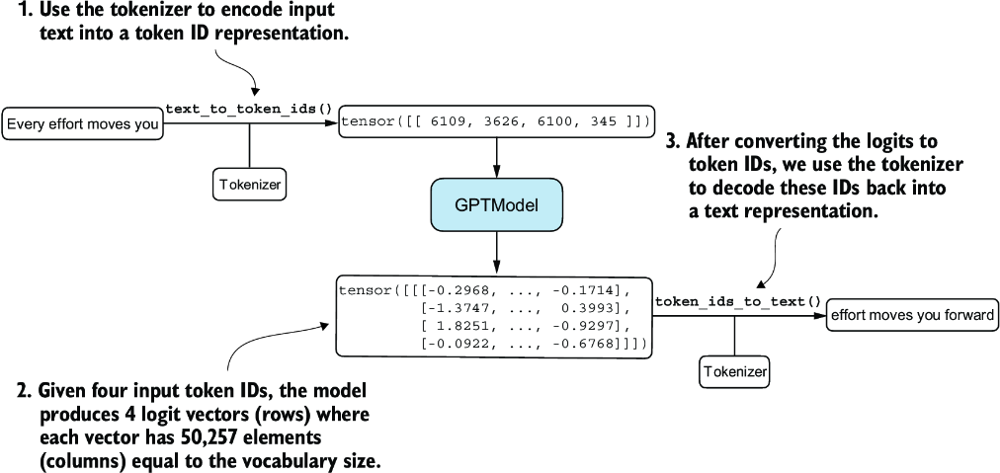

CHATPER 5 Pretraining on unlabeled data
=======================================

Over view the progress so far:

.. image:: c5/5-1.png

This chapter focuses on the pretraining the LLM.

5.1 Evaluating generative text models
-------------------------------------

An overview of the topics coverd in this chapter.

.. image:: c5/5-2.png

5.1.1 Using GPT to generate text
~~~~~~~~~~~~~~~~~~~~~~~~~~~~~~~~

.. code-block:: python

   import torch
   from chapter04 import GPTModel

   GPT_CONFIG_124M = {
       "vocab_size": 50257,
       "context_length": 256,
       "emb_dim": 768,
       "n_heads": 12,
       "n_layers": 12,
       "drop_rate": 0.1,
       "qkv_bias": False
   }
   torch.manual_seed(123)
   model = GPTModel(GPT_CONFIG_124M)
   model.eval()

.. code-block:: python

   import tiktoken
   from chapter04 import generate_text_simple

   def text_to_token_ids(text, tokenizer):
       encoded = tokenizer.encode(text, allowed_special={'<|endoftext|>'})
       encoded_tensor = torch.tensor(encoded).unsqueeze(0)
       return encoded_tensor

   def token_ids_to_text(token_ids, tokenizer):
       flat = token_ids.squeeze(0)
       return tokenizer.decode(flat.tolist())

   start_context = "Every effort moves you"
   tokenizer = tiktoken.get_encoding("gpt2")

   token_ids = generate_text_simple(
       model=model,
       idx=text_to_token_ids(start_context, tokenizer),
       max_new_tokens=10,
       context_size=GPT_CONFIG_124M["context_length"]
   )
   print("Output text:\n", token_ids_to_text(token_ids, tokenizer))

Nothing new here. Simple functions of encode and decode.

.. note::
   Output text:
   Every effort moves you rentingetic wasnم refres RexMeCHicular

Since the model has not been trained yet. The result looks mess is totally normal.

5.1.2 Calculating the text generation loss
~~~~~~~~~~~~~~~~~~~~~~~~~~~~~~~~~~~~~~~~~~

How to measure the quality of model's output?

We can use: **Cross-entropy and perplexity**

