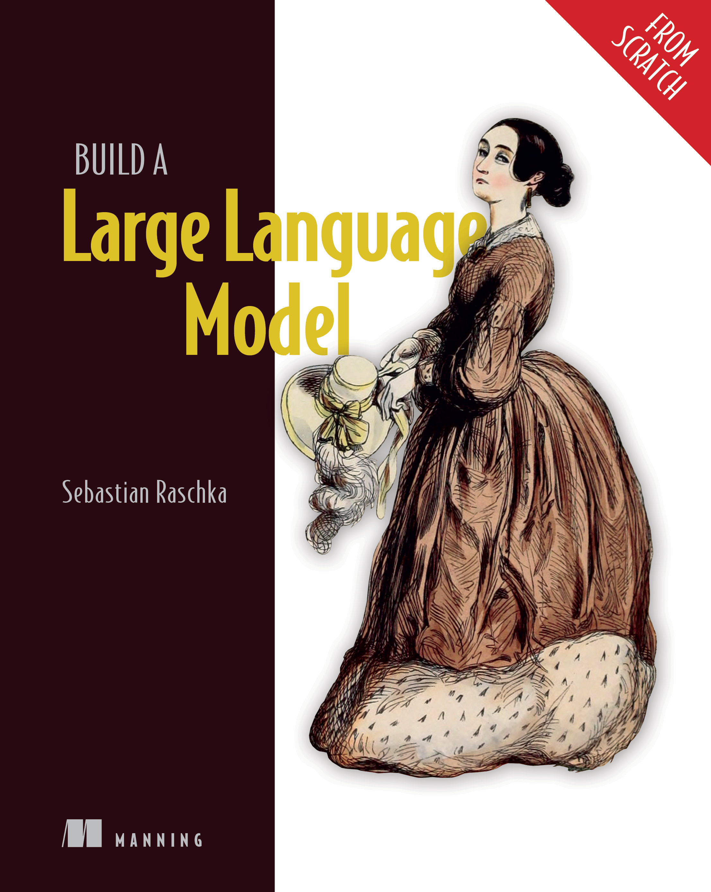

----

(●'ω'●) Build a Large Language Model (From Scratch)
===========================================

Author: Sebastian Raschka

----

Disclaimer
This work is a personal analysis and annotation of the book [Build a Large Language Model (From Scratch)], created solely for educational and non-commercial purposes. All original content remains the property of the respective authors and publishers. No copyright infringement is intended. The content presented here is intended to support learning and academic discussion only.

免责声明
本作品仅为个人对《Build a Large Language Model (From Scratch)》的分析与备注，目的仅限于学习和非商业用途。所有原始内容的版权归原作者及出版方所有，本文无意侵犯版权。所呈现内容仅用于学习与学术交流。

----

Welcome to this guide...

- Version: 1.0
- Date: June 2025

.. toctree::
   :maxdepth: 2

   chapter1_7

